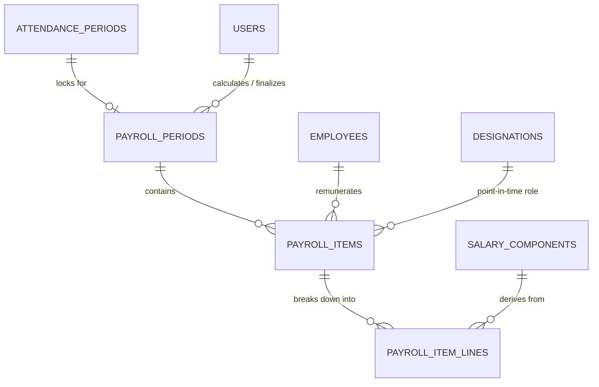
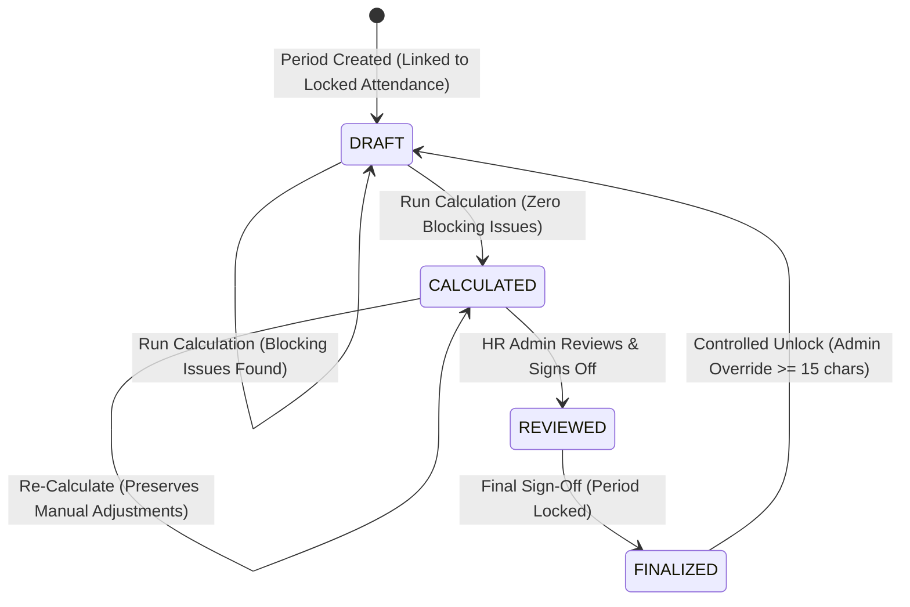

# Phase 4 Architecture: Payroll Processing Engine & Financial Traceability

**System:** Blue Royal HRMS  
**Module:** Phase 4 — Payroll Engine & Financial Integrity  
**Status:** Architectural Plan (Pre-Implementation Pass — Ready for Review)  
**Baseline Standards:** `Master.md`, `FINAL_ARCHITECTURE.md`, `docs/PROJECT_STATUS.md`, `docs/architecture/PHASE2_ATTENDANCE_ARCHITECTURE.md`, `docs/architecture/PHASE3_LEAVE_ARCHITECTURE.md`

---

## 1. Domain Overview & Architectural Principles

The Payroll Processing Engine is the core financial disbursement domain of Blue Royal HRMS. Its responsibility is to transform locked operational attendance records, effective-dated employee compensation models, and verified leave statuses into reproducible, auditable, and immutable employee remuneration records.

```
┌────────────────────────────────────────────────────────────────────────────────────────┐
│                                 UPSTREAM DOMAINS                                       │
│                                                                                        │
│   ┌───────────────────────────┐                      ┌─────────────────────────────┐   │
│   │   Phase 2: Attendance     │                      │   Phase 1: Compensation     │   │
│   │   • Daily Regular Hours   │                      │   • employee_hourly_rates   │   │
│   │   • Daily OT Hours        │                      │   • employee_salary_structs │   │
│   │   • Absence & Shifts      │                      │   • salary_components       │   │
│   │   • Status: LOCKED ONLY   │                      │   • Point-in-time validity  │   │
│   └─────────────┬─────────────┘                      └──────────────┬──────────────┘   │
│                 │                                                   │                  │
│                 │           ┌─────────────────────────────┐         │                  │
│                 │           │     Phase 3: Leave          │         │                  │
│                 │           │     • Approved Leave Dates  │         │                  │
│                 │           │     • Paid vs Unpaid Types  │         │                  │
│                 │           └──────────────┬──────────────┘         │                  │
│                 │                          │                        │                  │
└─────────────────┼──────────────────────────┼────────────────────────┼──────────────────┘
                  ▼                          ▼                        ▼
┌────────────────────────────────────────────────────────────────────────────────────────┐
│                              PHASE 4: PAYROLL DOMAIN                                   │
│                                                                                        │
│   ┌────────────────────────────────────────────────────────────────────────────────┐   │
│   │                             payroll_periods                                    │   │
│   │   • period_code (YYYY-MM)          • attendance_period_id (LOCKED)             │   │
│   │   • status: DRAFT ➔ CALCULATED ➔ REVIEWED ➔ FINALIZED                          │   │
│   │   • Summary Totals (Gross, Deductions, Net, Headcount)                         │   │
│   └───────────────────────────────────────┬────────────────────────────────────────┘   │
│                                           │ 1:N                                        │
│                                           ▼                                            │
│   ┌────────────────────────────────────────────────────────────────────────────────┐   │
│   │                              payroll_items                                     │   │
│   │   • employee_id                    • remuneration_basis (hourly / salaried)    │   │
│   │   • gross_pay                      • total_deductions        • net_pay         │   │
│   │   • regular_hours, ot_hours        • leave_days, absence_days                  │   │
│   │   • has_blocking_issue             • blocking_reason                           │   │
│   └───────────────────────────────────────┬────────────────────────────────────────┘   │
│                                           │ 1:N                                        │
│                                           ▼                                            │
│   ┌────────────────────────────────────────────────────────────────────────────────┐   │
│   │                            payroll_item_lines                                  │   │
│   │   • category: earning | deduction | adjustment                                 │   │
│   │   • is_manual: boolean             • adjustment_type: addition | deduction     │   │
│   │   • code: REGULAR_PAY, OT_PAY, BASIC, HRA, MANUAL_ADJUSTMENT, etc.             │   │
│   │   • rate, quantity, amount, component_id (Traceable Line Breakdown)            │   │
│   └────────────────────────────────────────────────────────────────────────────────┘   │
└────────────────────────────────────────────────────────────────────────────────────────┘
```

### Core Architectural Invariants
1. **LOCKED Attendance Gate:** Payroll calculation strictly requires that the referenced `attendance_periods.status == 'locked'`. Processing `draft`, `submitted`, or `approved` attendance is strictly forbidden.
2. **Authoritative Remuneration Basis (Zero Guesswork):** The system must never infer remuneration type merely from the presence of rate rows. The engine strictly consults `employees.remuneration_basis` (`hourly` vs `salaried`).
3. **Strict Dual-Stream Cost Decoupling:** Remuneration is computed exclusively from `employee_hourly_rates` or `employee_salary_structures`. **Payroll rates must NEVER depend upon `client_billing_rates`**.
4. **Calculation Reproducibility:** Payroll results are deterministic. The formula:
   $$\text{Locked Inputs} + \text{Effective Configuration on Work Date} + \text{Preserved Adjustments} \implies \text{Identical Net Result}$$
5. **Transparent Line-Item Breakdown:** The system records full itemized calculation lines (`payroll_item_lines`) for every employee, eliminating black-box totals.
6. **Zero-Assumption Financial Rule:** The engine never guesses or defaults a missing pay rate. If an employee has worked hours but no valid rate exists for that date, the calculation **blocks** the employee item, flags an anomaly, and prevents finalization.
7. **Immutable Finalization & Controlled Unlock:** Once finalized, records are read-only. Unlocking requires a mandatory audit reason ($\ge 15$ chars), returns the period to `DRAFT`, requires re-calculation, and generates tamper-evident audit logs.
8. **WPS SIF Implementation Boundary:** Phase 4 focuses on core calculations, adjustments, review, finalization, payslips, and self-service. Production WPS SIF file generation is deferred until company bank and MOHRE specifications are formally provided.

---

## 2. Confirmed Payroll Business Rules

To prevent scope creep or inventing statutory rules, all business rules are segregated into three strict categories:

### A. Explicitly Confirmed Rules
1. **Dual Remuneration Schemes:**
   - **Hourly Workers:** Compensated based on point-in-time `employee_hourly_rates` (`normal_hourly_rate`, `ot_hourly_rate`) multiplied by daily locked timesheet hours (`regular_hours`, `ot_hours`).
   - **Salaried Workers:** Compensated based on monthly packages defined in `employee_salary_structures` and `salary_components` (`fixed_amount` or `percentage`).
2. **Attendance Dependency:** Only locked attendance periods can be consumed.
3. **Point-in-Time Effective Dating:** Rates and compensation packages must resolve using the exact interval (`effective_from` $\le \text{date} \le$ `effective_to`) active on each work date.
4. **Three Confirmed Enterprise Roles:**
   - `hr_admin`: Normal operational authority (create run, trigger calculation, add adjustments, review items, finalize).
   - `super_admin`: Administrative override authority and unlock capabilities.
   - `employee`: Read-only self-service access to own payslips. Zero operational authority.

### B. Technically Inferred Rules (Architecture Consistent)
1. **Monthly Period Cycle:** Aligns 1:1 with the Phase 2 calendar monthly attendance cycle (`period_code` format `YYYY-MM`).
2. **Hourly Pay Line Breakdown:**
   $$\text{Daily Regular Pay} = \text{regular\_hours} \times \text{normal\_hourly\_rate}$$
   $$\text{Daily OT Pay} = \text{ot\_hours} \times \text{ot\_hourly\_rate}$$
   Gross hourly pay equals the sum of daily regular and OT pay across the locked period dates.
3. **Percentage Salary Components:** Percentage components compute strictly against their declared `percentage_basis_component_id` (e.g., HRA configured as 40% of BASIC).
4. **Reopening / Reversal Protocol:** Controlled unlock reverts status to `DRAFT`, requires re-run, and logs to `audit_logs`.

### C. Not Yet Defined / Requires Business Decision (Neutral Safeguards)
The following are **NOT** hardcoded or assumed in Phase 4:
1. *Absence / Unpaid Leave Deduction Formula:* (e.g., whether to deduct $\frac{\text{Gross}}{30}$, $\frac{\text{Basic}}{30}$, or $\frac{\text{Gross}}{\text{Working Days}}$).  
   *Neutral Safeguard:* Absence and unpaid leave days are tracked and tallied in `payroll_items` as quantitative counts. The deduction rate is not hardcoded with an assumed formula; deductions are driven either by explicit configured deduction components or manual adjustments until formally confirmed.
2. *Statutory UAE Pension / GPSSA:* (Differs for UAE/GCC nationals vs expatriates).  
   *Neutral Safeguard:* Zero automatic deductions are assumed. Configured only if explicitly mapped via `salary_components`.
3. *WPS SIF Column Specifications:* Bank routing codes, employer MOHRE IDs, and SIF file headers.  
   *Neutral Safeguard:* Phase 4 delivers the structured payroll run data, net pay calculation, and audit lines. Generation of the physical bank SIF file is isolated behind an architectural integration boundary, deferred until bank specifications are provided.
4. *Overtime Multiplier for Salaried Staff:* Whether monthly salaried workers are entitled to OT and at what multiplier.  
   *Neutral Safeguard:* Salaried compensation is derived strictly from active `employee_salary_structures`.

---

## 3. Remuneration Model Authority: Resolving the Architecture Gap

### 3.1 Gap Analysis
In Phase 1, `employee_hourly_rates` and `employee_salary_structures` were implemented as separate tables. However, the `employees` profile did not contain an explicit field declaring whether the worker's compensation is contractually hourly-paid or monthly-salaried. Inferring this at runtime based on which table has rows is ambiguous and dangerous (e.g., if an employee transitions from hourly to salaried, or if rates are configured erroneously).

### 3.2 Authoritative Solution: `employees.remuneration_basis`
In Phase 4, the system introduces one authoritative, non-nullable enumeration on the employee profile:
```sql
ALTER TABLE employees 
ADD COLUMN remuneration_basis VARCHAR(16) NOT NULL DEFAULT 'hourly'
CHECK (remuneration_basis IN ('hourly', 'salaried'));
```

### 3.3 Engine Execution Rule
When the payroll engine runs:
1. It queries `employee.remuneration_basis`.
2. **If `hourly`:**
   - The engine strictly calculates pay from timesheets and `employee_hourly_rates`.
   - It ignores any entries in `employee_salary_structures`.
   - If an hourly rate is missing on any day with logged regular or OT hours, it raises a `MISSING_HOURLY_RATE` blocking anomaly.
3. **If `salaried`:**
   - The engine strictly resolves the package from `employee_salary_structures`.
   - It ignores hourly rate cards for regular pay.
   - If no active salary structure exists, it raises a `MISSING_SALARY_STRUCTURE` blocking anomaly.

---

## 4. Manual Payroll Adjustments Specification

To handle ad-hoc operational adjustments (e.g., site allowances, approved bonuses, advance salary recoveries, equipment damages) without inventing statutory rules or creating bloated tables, Phase 4 utilizes `payroll_item_lines` with explicit adjustment metadata:

### 4.1 Schema Definition (`payroll_item_lines`)
- `category`: `'earning' | 'deduction' | 'adjustment'`
- `is_manual`: `BOOLEAN NOT NULL DEFAULT false`
- `adjustment_type`: `'addition' | 'deduction'` (Nullable for automated lines; Required for manual adjustments)
- `amount`: `NUMERIC(12,2) NOT NULL` (Strictly positive magnitude; operational effect is dictated by `adjustment_type`)
- `description`: `VARCHAR(255) NOT NULL` (Mandatory reason detailing the operational justification, $\ge 5$ characters)
- `created_by`: `UUID FK ➔ users(id)` (Audit actor ID)

### 4.2 Lifecycle & Operational Rules
1. **Creation:** HR Admin can add manual adjustments to an employee's item while the period is in `DRAFT` or `CALCULATED` status.
2. **Calculation Impact:**
   - `addition`: Increases `gross_pay` and `net_pay`.
   - `deduction`: Increases `total_deductions` and decreases `net_pay`.
   - Period summary cards (`total_gross_pay`, `total_deductions`, `total_net_pay`) update atomically in the same transaction.
3. **Recalculation Persistence:**
   - When HR Admin triggers *"Recalculate Period"*, the engine wipes and rebuilds **only system-generated lines** (`is_manual = false`).
   - All manual adjustments (`is_manual = true`) are **strictly preserved** and re-aggregated into the refreshed totals.
4. **Deletion:** HR Admin can delete a manual adjustment prior to finalization. The line is purged and period totals are re-summed.
5. **Finalization Protection:**
   - When `payroll_periods.status == 'finalized'`, all modification and deletion endpoints reject requests with `400 Bad Request ("Finalized payroll records are immutable")`.
6. **Audit Trail:**
   - Creating an adjustment dispatches `PAYROLL_ADJUSTMENT_CREATED` to `audit_logs` with `{ payrollPeriodId, employeeId, lineId, adjustmentType, amount, reason, actorId }`.
   - Deleting an adjustment dispatches `PAYROLL_ADJUSTMENT_DELETED`.

---

## 5. Database Entity Model

Phase 4 defines **three core relational tables**:



### 5.1 Table 1: `payroll_periods`
Governs the monthly payroll run lifecycle, period totals, and gatekeepers.

| Column | Type | Nullable | Constraints / Description |
|---|---|---|---|
| `id` | UUID | No | Primary Key, `DEFAULT gen_random_uuid()` |
| `period_code` | VARCHAR(32) | No | Unique (e.g. `2026-05`). Matches attendance cycle |
| `name` | VARCHAR(100) | No | Display name (e.g. `May 2026 Payroll`) |
| `start_date` | DATE | No | Period start date (e.g. `2026-05-01`) |
| `end_date` | DATE | No | Period end date (e.g. `2026-05-31`) |
| `attendance_period_id` | UUID | No | FK ➔ `attendance_periods(id)` ON DELETE RESTRICT |
| `status` | VARCHAR(32) | No | Enum: `draft`, `calculated`, `reviewed`, `finalized`. Default: `draft` |
| `total_gross_pay` | NUMERIC(14,2) | No | Default: `0.00` |
| `total_deductions` | NUMERIC(14,2) | No | Default: `0.00` |
| `total_net_pay` | NUMERIC(14,2) | No | Default: `0.00` |
| `employee_count` | INTEGER | No | Default: `0` |
| `blocking_issues_count` | INTEGER | No | Default: `0`. Blocks review and finalization if $> 0$ |
| `calculated_by` | UUID | Yes | FK ➔ `users(id)` ON DELETE SET NULL |
| `calculated_at` | TIMESTAMPTZ | Yes | Timestamp of last calculation |
| `reviewed_by` | UUID | Yes | FK ➔ `users(id)` ON DELETE SET NULL |
| `reviewed_at` | TIMESTAMPTZ | Yes | Timestamp of review sign-off |
| `finalized_by` | UUID | Yes | FK ➔ `users(id)` ON DELETE SET NULL |
| `finalized_at` | TIMESTAMPTZ | Yes | Timestamp of final lock |
| `unlock_reason` | TEXT | Yes | Audit justification for reopening ($ \ge 15$ chars) |
| `unlocked_by` | UUID | Yes | FK ➔ `users(id)` ON DELETE SET NULL |
| `unlocked_at` | TIMESTAMPTZ | Yes | Timestamp of unlock |
| `created_at` | TIMESTAMPTZ | No | Timestamp |
| `updated_at` | TIMESTAMPTZ | No | Timestamp |

**Indexes & Constraints:**
- `uq_payroll_periods_code`: UNIQUE (`period_code`)
- `uq_payroll_attendance_period`: UNIQUE (`attendance_period_id`)
- `chk_payroll_period_dates`: CHECK (`end_date >= start_date`)

---

### 5.2 Table 2: `payroll_items`
Stores consolidated remuneration and timesheet metrics per employee for the period.

| Column | Type | Nullable | Constraints / Description |
|---|---|---|---|
| `id` | UUID | No | Primary Key, `DEFAULT gen_random_uuid()` |
| `payroll_period_id` | UUID | No | FK ➔ `payroll_periods(id)` ON DELETE CASCADE |
| `employee_id` | UUID | No | FK ➔ `employees(id)` ON DELETE RESTRICT |
| `remuneration_basis` | VARCHAR(16) | No | Enum: `hourly`, `salaried` (Derived authoritatively from employee) |
| `designation_id` | UUID | Yes | FK ➔ `designations(id)` ON DELETE RESTRICT |
| `days_in_period` | INTEGER | No | Calendar days in cycle |
| `total_actual_hours` | NUMERIC(6,2) | No | Total hours logged |
| `total_regular_hours` | NUMERIC(6,2) | No | Regular hours logged |
| `total_ot_hours` | NUMERIC(6,2) | No | Overtime hours logged |
| `total_absence_days` | INTEGER | No | Days marked absent |
| `total_leave_days` | NUMERIC(5,2) | No | Approved leave days |
| `gross_pay` | NUMERIC(12,2) | No | Calculated gross remuneration |
| `total_deductions` | NUMERIC(12,2) | No | Total deductions |
| `net_pay` | NUMERIC(12,2) | No | Net payable: `gross_pay - total_deductions` |
| `has_blocking_issue` | BOOLEAN | No | Default: `false`. True if missing rates or invalid config |
| `blocking_reason` | TEXT | Yes | Descriptive explanation (e.g. `MISSING_HOURLY_RATE on 2026-05-12`) |
| `created_at` | TIMESTAMPTZ | No | Timestamp |
| `updated_at` | TIMESTAMPTZ | No | Timestamp |

**Indexes & Constraints:**
- `uq_payroll_item_emp_period`: UNIQUE (`payroll_period_id`, `employee_id`)
- `idx_payroll_item_lookup`: (`employee_id`, `payroll_period_id`)

---

### 5.3 Table 3: `payroll_item_lines`
Stores the individual calculation lines and preserved manual adjustments explaining gross pay, deductions, and net pay.

| Column | Type | Nullable | Constraints / Description |
|---|---|---|---|
| `id` | UUID | No | Primary Key, `DEFAULT gen_random_uuid()` |
| `payroll_item_id` | UUID | No | FK ➔ `payroll_items(id)` ON DELETE CASCADE |
| `category` | VARCHAR(16) | No | Enum: `earning`, `deduction`, `adjustment` |
| `is_manual` | BOOLEAN | No | Default: `false`. True for HR Admin manual adjustments |
| `adjustment_type` | VARCHAR(16) | Yes | Enum: `addition`, `deduction`. Required if `is_manual = true` |
| `code` | VARCHAR(32) | No | Line code (`REGULAR_PAY`, `OT_PAY`, `BASIC`, `HRA`, `MANUAL_ADJUSTMENT`) |
| `description` | VARCHAR(255) | No | Human-readable explanation / mandatory justification |
| `rate` | NUMERIC(10,2) | Yes | Applicable rate (e.g. normal hourly wage or base amount) |
| `quantity` | NUMERIC(8,2) | Yes | Quantity (e.g. hours worked or units) |
| `amount` | NUMERIC(12,2) | No | Magnitude of line item amount (always positive) |
| `salary_component_id` | UUID | Yes | FK ➔ `salary_components(id)` ON DELETE RESTRICT |
| `work_date` | DATE | Yes | Point-in-time date for daily rate application (if applicable) |
| `created_by` | UUID | Yes | FK ➔ `users(id)` ON DELETE SET NULL (Actor for manual adjustments) |
| `created_at` | TIMESTAMPTZ | No | Timestamp |

**Indexes:**
- `idx_payroll_lines_item`: (`payroll_item_id`, `category`)
- `idx_payroll_lines_manual`: (`payroll_item_id`, `is_manual`)

---

## 6. Lifecycle & State Machine



| Lifecycle State | Description | Modifiable? | Adjustments Allowed? | Blocking Issues Permitted? |
|---|---|:---:|:---:|:---:|
| `DRAFT` | Initial run created or unlocked after correction. | Yes | Yes | Yes (Visible to HR) |
| `CALCULATED` | Engine ran successfully across all employees. | Yes | Yes | No (Must be 0 to advance) |
| `REVIEWED` | HR Admin reviewed all employee totals and exceptions. | Yes | No | No |
| `FINALIZED` | Period formally locked for payment and payslip release. | **NO (Read-only)** | **NO** | No |

---

## 7. Role-Based Access Control (RBAC)

Phase 4 strictly utilizes the three confirmed roles: `super_admin`, `hr_admin`, and `employee`.

| Permission Code | Description | Super Admin | HR Admin | Employee |
|---|---|:---:|:---:|:---:|
| `payroll:read` | View payroll periods, summaries, and employee breakdowns | ✅ | ✅ | ❌ |
| `payroll:create` | Create new payroll period linked to locked attendance | ✅ | ✅ | ❌ |
| `payroll:calculate` | Trigger engine calculation, recalculation, and adjustments | ✅ | ✅ | ❌ |
| `payroll:review` | Sign off on calculated payroll items | ✅ | ✅ | ❌ |
| `payroll:finalize` | Immutably lock period and authorize payslips | ✅ | ✅ | ❌ |
| `payroll:unlock` | Revert finalized payroll to draft with audit reason | ✅ | ❌ (Override only) | ❌ |
| `payroll:self_read` | View own payslip and historical remuneration | ❌ | ❌ | ✅ |

---

## 8. REST API Architecture

Base URL: `/api/v1/payroll`

### 8.1 HR Admin Endpoints
- `GET /periods`: List all payroll periods with summary totals, status, and blocking counts.
- `POST /periods`: Create a new payroll period (`attendancePeriodId`, `periodCode`, `name`).
- `GET /periods/:id`: Get detailed period metadata and summary cards.
- `POST /periods/:id/calculate`: Execute calculation engine across all eligible employees.
- `GET /periods/:id/items`: Paginated employee payroll items with filter by status (`all`, `blocked`, `hourly`, `salaried`).
- `GET /periods/:id/items/:itemId`: Detailed employee breakdown including all `payroll_item_lines`.
- `POST /periods/:id/items/:itemId/adjustments`: Add manual adjustment (`type: 'addition'|'deduction'`, `amount`, `description`).
- `DELETE /periods/:id/items/:itemId/adjustments/:lineId`: Remove manual adjustment line.
- `POST /periods/:id/review`: Mark period as `reviewed`.
- `POST /periods/:id/finalize`: Immutably finalize period (`finalized`).
- `POST /periods/:id/unlock`: Controlled unlock (`reason` $\ge 15$ chars). Reverts to `draft`.

### 8.2 Employee Self-Service Endpoints
- `GET /my-payroll`: List employee's finalized payroll periods and net pay history.
- `GET /my-payroll/:periodId/payslip`: Detailed payslip breakdown for the employee (regular hours, OT, earnings, deductions, net pay). Rejects unfinalized periods.
