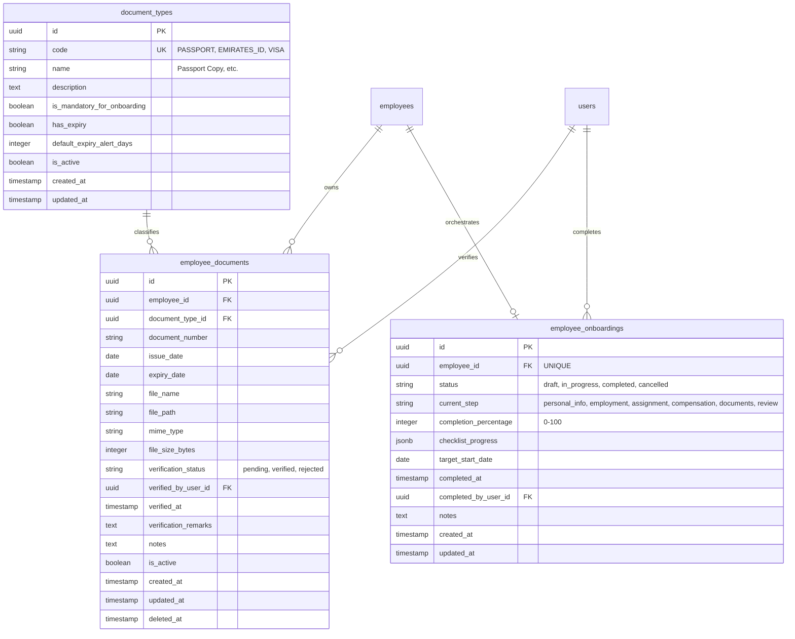

# Phase 5 Architecture Specification: Employee Onboarding, Documents & Expiry Tracking

**Document ID:** `ARCH-PHASE5-001`  
**Phase:** Phase 5  
**Domain:** Workforce Onboarding, Employee Document Management & Regulatory Expiry Compliance  
**Author:** Blue Royal HRMS Architectural Engineering  
**Status:** Approved for Implementation  

---

## 1. Executive Architecture Overview

Phase 5 introduces comprehensive lifecycle orchestration for new hires and ongoing compliance management for employee identity and statutory records:
1. **Employee Onboarding Orchestrator:** Manages the pre-hire to active employee transition across a 5-step configurable checklist (Biographical Identity, Statutory Contract, Work Deployment & Shift, Compensation Structure, Mandatory Compliance Documents).
2. **Employee Documents Domain:** Fully decoupled from the core `employees` table, supporting configurable `document_types`, structured metadata, multi-part document verification workflows, and safe local disk storage references.
3. **Deterministic Expiry Engine:** Centralized, timezone-safe backend calculation service classifying records into **Valid** (`> 60 days`), **Approaching Expiry / Notice Window** (`30–60 days`), **Critical Expiry** (`< 30 days`), and **Expired** (`<= 0 days`).
4. **Operational Compliance Visibility:** Embedded across the operational dashboard, dedicated compliance console, employee profile tabs, and employee self-service.

---

## 2. Gap Analysis & Architectural Inventory

### 2.1 Existing Infrastructure Reused
- **Core Identity (`Employee` model):** Reused without duplicate data models. Onboarding orchestrates the existing `Employee`, `EmployeeAssignment`, `EmployeeHourlyRate`, `EmployeeSalaryStructure`, and `EmployeeShiftAssignment` tables.
- **Audit Logging Engine (`AuditService`):** All onboarding status transitions, document uploads, verifications, metadata updates, and deletions are recorded to the append-only `audit_logs` table.
- **RBAC Infrastructure (`requirePermission`):** Gated by granular permissions across `super_admin`, `hr_admin`, and `employee` personas.
- **Shared Contracts (`packages/contracts`):** TypeScript DTOs, request payloads, and response envelopes shared across backend and frontend.

### 2.2 New Tables Required
| Table Name | Purpose | Primary Key | Foreign Keys |
|---|---|---|---|
| `document_types` | Configurable catalog of acceptable documents | UUID v4 | None |
| `employee_documents` | Employee-attached document records & metadata | UUID v4 | `employee_id` -> `employees.id`, `document_type_id` -> `document_types.id`, `verified_by_user_id` -> `users.id` |
| `employee_onboardings` | Server-persisted onboarding workflow instance & checklist | UUID v4 | `employee_id` -> `employees.id`, `completed_by_user_id` -> `users.id` |

---

## 3. Database Schema Design

---

## 4. Deterministic Expiry Calculation Engine

Expiry classification is strictly centralized in `DocumentExpiryService`. No controller or frontend component computes expiry thresholds with custom arithmetic.

### 4.1 Boundary Matrix
Let DateDiffInDays(expiryDate, currentDate) using UTC zero-hour comparison:

| Condition | Classification Status | Urgency Level | Visual Token |
|---|---|---|---|
| diff < 0 | `expired` | Critical / Action Required | Crimson Red (`--color-danger`) |
| 0 <= diff <= 30 | `critical_expiry` | High (Immediate Renewal) | Warning Amber (`--color-warning`) |
| 31 <= diff <= 60 | `approaching_expiry` | Moderate (Notice Window) | Informational Blue (`--color-info`) |
| diff > 60 | `valid` | Normal / Compliant | Success Emerald (`--color-success`) |
| `has_expiry = false` | `not_applicable` | Permanent / Non-Expiring | Neutral Gray (`--color-text-muted`) |

---

## 5. Storage Abstraction Pattern

Binary files must NOT be stored as raw BLOBs in PostgreSQL:
1. Files are uploaded via standard multipart streaming.
2. Saved to a configurable local secure storage directory: `storage/documents/<employee_id>/<uuid>_<sanitized_filename>`.
3. Database stores relative reference: `storage/documents/...`.
4. File access endpoint streams file with proper `Content-Type` and `Content-Disposition`, authorized strictly via RBAC (preventing unauthorized document access across employees).

---

## 6. RBAC & Permissions Architecture

| Permission Code | Description | Super Admin | HR Admin | Employee |
|---|---|:---:|:---:|:---:|
| `onboarding:create` | Start onboarding for new hire | Yes | Yes | No |
| `onboarding:read` | View onboarding queue & progress | Yes | Yes | No |
| `onboarding:update` | Update checklist steps & progress | Yes | Yes | No |
| `onboarding:complete` | Finalize & activate employee | Yes | Yes | No |
| `documents:read` | View company-wide document registry | Yes | Yes | No |
| `documents:create` | Upload document for any employee | Yes | Yes | No |
| `documents:update` | Edit document metadata | Yes | Yes | No |
| `documents:delete` | Soft-delete document record | Yes | Yes | No |
| `documents:verify` | Approve or reject compliance status | Yes | Yes | No |
| `documents:self_read` | View own documents in ESS portal | Yes | Yes | Yes |
| `documents:self_upload`| Upload personal document copy in ESS | Yes | Yes | Yes |
| `expiry:read` | View expiry alerts and telemetry | Yes | Yes | No |

---

## 7. Audit Event Taxonomy

Every mutation triggers `AuditService.recordEvent`:
- `ONBOARDING_STARTED`: Initiated new hire workflow.
- `ONBOARDING_PROGRESS_UPDATED`: Checklist item marked complete.
- `ONBOARDING_COMPLETED`: Final readiness validation passed, employee activated.
- `DOCUMENT_UPLOADED`: New document stored.
- `DOCUMENT_METADATA_UPDATED`: Dates or reference numbers edited.
- `DOCUMENT_VERIFIED`: Document approved by HR.
- `DOCUMENT_REJECTED`: Document rejected with reason.
- `DOCUMENT_DELETED`: Document soft-deleted.
