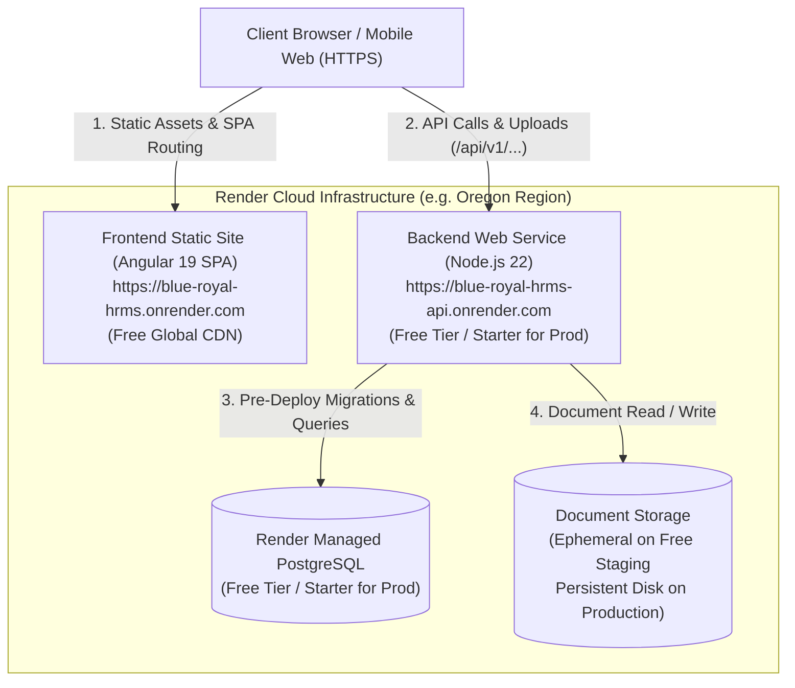

# BLUE ROYAL HRMS — RENDER DEPLOYMENT RUNBOOK (FREE STAGING & PRODUCTION)

This guide provides the authoritative, end-to-end procedure for deploying Blue Royal HRMS to Render.

---

## 1. Deployment Tier Overview

| Tier | Blueprint File | Monthly Cost | Web Service Plan | PostgreSQL Plan | Document Storage |
| :--- | :--- | :--- | :--- | :--- | :--- |
| **Staging / UAT / Demo** | [`render.yaml`](file:///f:/Folkslogic/blue-royal/HRMS/render.yaml) | **$0.00 / month (Free)** | `free` | `free` | Ephemeral container storage |
| **Production** | [`render.prod.yaml`](file:///f:/Folkslogic/blue-royal/HRMS/render.prod.yaml) | Standard ($7–$14/mo) | `starter` | `starter` | 10GB Attached Persistent Disk |

> [!NOTE]
> **Free Staging Storage Characteristics**:
> On Render's Free tier, the backend web service runs in an ephemeral container. Document upload, verification, and download workflows operate normally, storing files in `/app/storage/documents`. If the free instance spins down due to inactivity or is redeployed, physical files are reset while document metadata in PostgreSQL is preserved. For persistent physical file retention, use the production Starter plan with persistent disk.

---

## 2. System Architecture



---

## 3. Fast-Track Deployment via Render Blueprint

### Deploying Free Staging ($0):
1. In your [Render Dashboard](https://dashboard.render.com), click **New +** $\rightarrow$ **Blueprint**.
2. Connect your Git repository (`blue-royal-hrms`).
3. Render automatically reads `render.yaml` and configures:
   - `blue-royal-postgres` (`plan: free`)
   - `blue-royal-hrms-api` (`plan: free`)
   - `blue-royal-hrms` (Static Site - Free)
4. Set `CORS_ORIGIN` to your frontend static site URL.
5. Click **Apply**.

### Deploying Production Tier (with Persistent Disk):
- When ready for production, point Render Blueprint to `render.prod.yaml` or upgrade the web service plan to `starter` and attach a 10GB persistent disk.

---

## 4. Manual Configuration Reference

### Frontend Static Site
- **Type**: `web`
- **Runtime**: `static`
- **Build Command**: `npm ci && npm run build:contracts && npm run build:frontend`
- **Publish Directory**: `frontend/dist/blue-royal-hrms/browser`
- **Rewrite Rule**: `/*` $\rightarrow$ `/index.html` (Rewrite)

### Backend Web Service
- **Type**: `web`
- **Runtime**: `node`
- **Build Command**: `npm ci && npm run build:contracts && npm run build:database && npm run build:backend`
- **Start Command (Free Staging)**: `npm run db:migrate && npm run start --workspace=backend`
- **Start Command (Production)**: `npm run start --workspace=backend` (with `preDeployCommand: npm run db:migrate`)
- **Health Check Path**: `/api/v1/health`

### Initial Database Seeding (Run once after first deploy)
1. Open the **Shell** tab on `blue-royal-hrms-api`.
2. Run:
   ```bash
   npm run db:seed
   ```
3. Default credentials:
   - **Email**: `admin@blueroyal.com`
   - **Password**: `Admin@123456`

---

## 5. Environment Variables Reference

| Variable | Value | Notes |
| :--- | :--- | :--- |
| `NODE_ENV` | `production` | Production optimizations |
| `PORT` | `10000` | Render internal port |
| `API_PREFIX` | `/api/v1` | Versioned API root |
| `CORS_ORIGIN` | `https://blue-royal-hrms.onrender.com` | Set to your frontend URL |
| `DATABASE_URL` | *(Render Internal PostgreSQL URL)* | Auto-injected via Blueprint |
| `DB_SSL` | `true` | Required for PostgreSQL SSL |
| `STORAGE_PATH` | `storage/documents` | Storage directory path |
| `COOKIE_SAME_SITE` | `none` | Cross-subdomain HTTPS cookie support |
| `COOKIE_SECURE` | `true` | HTTPS cookie security |
| `JWT_ACCESS_SECRET` | *(Render auto-generated)* | Token signature secret |
| `JWT_REFRESH_SECRET` | *(Render auto-generated)* | Refresh token signature |
| `LOG_LEVEL` | `info` | Structured logging |

---

## 6. Post-Deployment Verification Checklist

- [ ] **Health Endpoint**: `GET https://<backend-url>/api/v1/health` $\rightarrow$ 200 OK (`"status": "healthy"`).
- [ ] **SPA Routing**: Direct refresh on `https://<frontend-url>/login` $\rightarrow$ Renders login screen without 404.
- [ ] **Authentication**: Log in with `admin@blueroyal.com` / `Admin@123456` $\rightarrow$ Redirects to dashboard.
- [ ] **Master Catalogs**: Open `/masters?tab=assignments` $\rightarrow$ Loads operational data.
- [ ] **Onboarding & Documents**: Open `/onboarding` and `/documents` $\rightarrow$ Upload sample PDF document.
- [ ] **Workforce Payroll & Leave**: Open `/payroll` and `/leave` $\rightarrow$ Verify calculation and request views.
