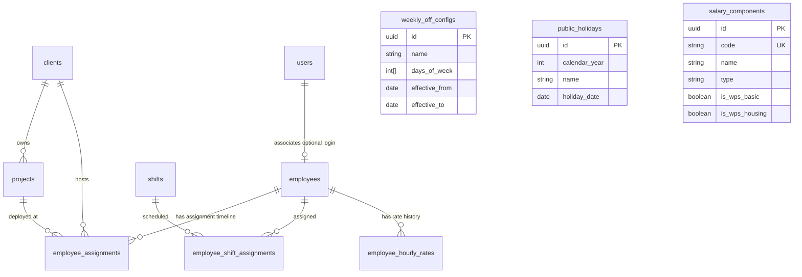

# Blue Royal HRMS — Phase 1 Architecture & Implementation Plan

**Document ID:** `DOC-PLAN-PHASE1-001`  
**Date:** 2026-09-08  
**Status:** Architectural Plan — Pending Review & Sign-Off  
**Scope:** Phase 1 Foundation Masters & Work Rostering Infrastructure  
**Prerequisites:** Phase 0 (Foundation, Auth, RBAC, Database & Audit Engine) — **Approved & Verified**

---

## 1. Executive Summary & Architectural Cohesion

Phase 1 transitions Blue Royal HRMS from the foundation layer into the **Core Master Data & Workforce Rostering Engine**. The goal of Phase 1 is to establish the source-of-truth master records and the temporal structures (effective-dated histories) required by downstream operational modules (Attendance, Overtime, Leave, Payroll, and WPS).

### Alignment with Phase 0 Patterns

1. **Layered Clean Architecture:** Strict Route ➔ Controller ➔ Service ➔ Model separation. No business logic in controllers or Angular views.
2. **Dedicated Tooling Workspace:** All schema DDL and seeders are placed in the `database/` workspace (Umzug migrations). Application models in `backend/src/modules/` only reflect runtime schemas.
3. **Contracts Package (`@blue-royal/contracts`):** Every Phase 1 DTO, request schema, and response payload is defined in `packages/contracts` and shared across backend and frontend.
4. **Sequelize Pool & Managed Transactions:** All multi-row updates (e.g., closing a previous effective rate and opening a new one) execute inside `runInTransaction`.
5. **Observability & Auditing:** All mutations dispatch structured audit events via `AuditService.recordEvent` capturing old and new JSONB values.

---

## 2. Temporal Data Model: Effective Dating & Historical Correctness

> [!IMPORTANT]
> **The Principle of Historical Integrity:**
> In an HRMS, calculations for past dates must evaluate the state of the employee _as it existed on that date_. Future salary increments, project transfers, or shift modifications must **never** alter historical attendance or payroll results.

The following modules strictly implement **Effective-Dated Records**:

1. **Employee Assignment** (`client_id`, `project_id`)
2. **Employee Hourly Rates** (`normal_hourly_rate`, `ot_hourly_rate`)
3. **Shift Assignments / Roster**

### Temporal Mechanics

- Every effective-dated table contains:
  - `effective_from` (DATE, NOT NULL) — Beginning of validity interval (inclusive).
  - `effective_to` (DATE, NULLABLE) — End of validity interval (inclusive). A `NULL` value denotes the currently active, ongoing record.
  - `is_active` (BOOLEAN, default `true`).
- **Mutation Workflow (Updating an Effective-Dated Record):**
  When an admin changes an employee's assignment or hourly rate effective as of date `D`:
  1. Wrapped in `runInTransaction`.
  2. Find the currently open record where `effective_to IS NULL` or `effective_to >= D`.
  3. Close previous record by setting `effective_to = D - 1 day`.
  4. Insert new record with `effective_from = D` and `effective_to = NULL`.
  5. Prevent overlapping intervals with database constraints / service-layer interval validations.

---

## 3. Detailed Specifications for the 8 Phase 1 Modules

---

### Module 1: Employee Master

#### 1.1 Business Purpose

Maintains the master record of employment identity, biographical info, compliance documentation (passport, visa, Emirates ID/national ID), department, and employment life-cycle status.

#### 1.2 Module Boundary

- Backend: `backend/src/modules/employee/`
- Contracts: `packages/contracts/src/employee/`
- Frontend: `frontend/src/app/features/employee/`

#### 1.3 Database Entity: `employees`

| Column               | Type         | Nullable | Constraints & Description                                                              |
| -------------------- | ------------ | -------- | -------------------------------------------------------------------------------------- |
| `id`                 | UUID         | No       | Primary Key, `gen_random_uuid()`                                                       |
| `employee_code`      | VARCHAR(32)  | No       | Unique, indexed (e.g. `BR-00104`)                                                      |
| `user_id`            | UUID         | Yes      | Foreign Key ➔ `users(id)` ON DELETE SET NULL (optional self-service login)             |
| `first_name`         | VARCHAR(100) | No       | Given name                                                                             |
| `middle_name`        | VARCHAR(100) | Yes      | Middle name                                                                            |
| `last_name`          | VARCHAR(100) | No       | Family name                                                                            |
| `gender`             | VARCHAR(16)  | No       | Enum: `male`, `female`, `other`                                                        |
| `date_of_birth`      | DATE         | No       | Date of birth                                                                          |
| `nationality`        | VARCHAR(64)  | No       | Country of nationality                                                                 |
| `email`              | VARCHAR(255) | Yes      | Work or personal email                                                                 |
| `phone_number`       | VARCHAR(32)  | Yes      | Primary phone number                                                                   |
| `national_id_number` | VARCHAR(64)  | Yes      | National ID / Emirates ID number                                                       |
| `national_id_expiry` | DATE         | Yes      | National ID expiration date                                                            |
| `passport_number`    | VARCHAR(64)  | Yes      | Passport number                                                                        |
| `passport_expiry`    | DATE         | Yes      | Passport expiration date                                                               |
| `visa_number`        | VARCHAR(64)  | Yes      | Visa / Permit number                                                                   |
| `visa_expiry`        | DATE         | Yes      | Visa expiration date                                                                   |
| `department`         | VARCHAR(100) | Yes      | Department or division name                                                            |
| `designation`        | VARCHAR(100) | No       | Official job title                                                                     |
| `date_of_joining`    | DATE         | No       | Official joining date                                                                  |
| `probation_end_date` | DATE         | Yes      | End of probation period                                                                |
| `status`             | VARCHAR(32)  | No       | Enum: `active`, `on_leave`, `probation`, `terminated`, `resigned`. Default `probation` |
| `created_at`         | TIMESTAMPTZ  | No       | Audit creation timestamp                                                               |
| `updated_at`         | TIMESTAMPTZ  | No       | Audit modification timestamp                                                           |
| `deleted_at`         | TIMESTAMPTZ  | Yes      | Paranoid soft delete                                                                   |

#### 1.4 API Endpoints

- `GET /api/v1/employees` — Paginated list with search (`code`, `name`, `status`, `department`).
- `GET /api/v1/employees/:id` — Detailed employee profile including current assignment and hourly rates.
- `POST /api/v1/employees` — Create new employee.
- `PUT /api/v1/employees/:id` — Update biographical and profile details.
- `DELETE /api/v1/employees/:id` — Soft-delete employee record.

#### 1.5 Permissions

- `employees:read`, `employees:create`, `employees:update`, `employees:delete`

---

### Module 2: Client Master

#### 2.1 Business Purpose

Maintains master records of corporate clients/contracting partners for whom services, projects, and manpower deployment are provided.

#### 2.2 Module Boundary

- Backend: `backend/src/modules/client/`
- Contracts: `packages/contracts/src/client/`
- Frontend: `frontend/src/app/features/client/`

#### 2.3 Database Entity: `clients`

| Column             | Type         | Nullable | Constraints & Description               |
| ------------------ | ------------ | -------- | --------------------------------------- |
| `id`               | UUID         | No       | Primary Key, `gen_random_uuid()`        |
| `code`             | VARCHAR(32)  | No       | Unique client code (e.g. `CLI-EMAAR`)   |
| `name`             | VARCHAR(255) | No       | Full legal company name                 |
| `trade_license_no` | VARCHAR(64)  | Yes      | Trade license / Commercial registration |
| `contact_person`   | VARCHAR(100) | Yes      | Primary contact name                    |
| `contact_email`    | VARCHAR(255) | Yes      | Primary contact email                   |
| `contact_phone`    | VARCHAR(32)  | Yes      | Primary contact telephone               |
| `billing_address`  | TEXT         | Yes      | Official billing address                |
| `is_active`        | BOOLEAN      | No       | Default `true`                          |
| `created_at`       | TIMESTAMPTZ  | No       | Creation timestamp                      |
| `updated_at`       | TIMESTAMPTZ  | No       | Modification timestamp                  |
| `deleted_at`       | TIMESTAMPTZ  | Yes      | Soft delete                             |

#### 2.4 API Endpoints

- `GET /api/v1/clients` — Paginated list of clients with active filter.
- `GET /api/v1/clients/:id` — Client details with associated projects.
- `POST /api/v1/clients` — Create new client.
- `PUT /api/v1/clients/:id` — Update client info.
- `DELETE /api/v1/clients/:id` — Soft-delete / deactivate client.

#### 2.5 Permissions

- `clients:read`, `clients:create`, `clients:update`, `clients:delete`

---

### Module 3: Project Master

#### 3.1 Business Purpose

Tracks specific projects, site locations, or service contracts associated with a client to which employees are deployed.

#### 3.2 Module Boundary

- Backend: `backend/src/modules/project/`
- Contracts: `packages/contracts/src/project/`
- Frontend: `frontend/src/app/features/project/`

#### 3.3 Database Entity: `projects`

| Column          | Type         | Nullable | Constraints & Description                                              |
| --------------- | ------------ | -------- | ---------------------------------------------------------------------- |
| `id`            | UUID         | No       | Primary Key, `gen_random_uuid()`                                       |
| `client_id`     | UUID         | No       | Foreign Key ➔ `clients(id)` ON DELETE RESTRICT                         |
| `code`          | VARCHAR(32)  | No       | Unique project code                                                    |
| `name`          | VARCHAR(255) | No       | Project or site name                                                   |
| `site_location` | VARCHAR(255) | Yes      | Physical worksite address or GPS coordinates                           |
| `start_date`    | DATE         | Yes      | Project inception date                                                 |
| `end_date`      | DATE         | Yes      | Project completion/expiry date                                         |
| `status`        | VARCHAR(32)  | No       | Enum: `planning`, `active`, `suspended`, `completed`. Default `active` |
| `created_at`    | TIMESTAMPTZ  | No       | Creation timestamp                                                     |
| `updated_at`    | TIMESTAMPTZ  | No       | Modification timestamp                                                 |
| `deleted_at`    | TIMESTAMPTZ  | Yes      | Soft delete                                                            |

#### 3.4 API Endpoints

- `GET /api/v1/projects` — Paginated list with filters by `client_id`, `status`.
- `GET /api/v1/projects/:id` — Project details.
- `POST /api/v1/projects` — Create project.
- `PUT /api/v1/projects/:id` — Update project.
- `DELETE /api/v1/projects/:id` — Soft-delete project.

#### 3.5 Permissions

- `projects:read`, `projects:create`, `projects:update`, `projects:delete`

---

### Module 4: Employee Assignment (Effective-Dated)

#### 4.1 Business Purpose

Tracks which client and project an employee is deployed to over time. Maintains 100% historical accuracy for cost allocation and billing.

#### 4.2 Module Boundary

- Backend: `backend/src/modules/assignment/`
- Contracts: `packages/contracts/src/assignment/`
- Frontend: `frontend/src/app/features/employee/components/assignment-history/`

#### 4.3 Database Entity: `employee_assignments`

| Column           | Type         | Nullable | Constraints & Description                       |
| ---------------- | ------------ | -------- | ----------------------------------------------- |
| `id`             | UUID         | No       | Primary Key, `gen_random_uuid()`                |
| `employee_id`    | UUID         | No       | Foreign Key ➔ `employees(id)` ON DELETE CASCADE |
| `client_id`      | UUID         | No       | Foreign Key ➔ `clients(id)` ON DELETE RESTRICT  |
| `project_id`     | UUID         | No       | Foreign Key ➔ `projects(id)` ON DELETE RESTRICT |
| `effective_from` | DATE         | No       | Start date of assignment                        |
| `effective_to`   | DATE         | Yes      | End date (`NULL` = current active assignment)   |
| `remarks`        | VARCHAR(255) | Yes      | Transfer reason or notes                        |
| `created_at`     | TIMESTAMPTZ  | No       | Creation timestamp                              |
| `updated_at`     | TIMESTAMPTZ  | No       | Modification timestamp                          |

**Indexes:**

- `CREATE INDEX idx_emp_assignments_active ON employee_assignments (employee_id, effective_from, effective_to);`

#### 4.4 Effective-Dating Business Rules

- At any point in time `T`, an employee may have **at most one** active assignment.
- Assigning an employee to a new Project/Client automatically closes their preceding open assignment as of `effective_from - 1 day`.
- Point-in-time lookup service: `getAssignmentForDate(employeeId: string, date: Date)`.

#### 4.5 API Endpoints

- `GET /api/v1/employees/:id/assignments` — List entire historical assignment timeline for an employee.
- `POST /api/v1/employees/:id/assignments` — Create a new assignment effective from a given date.

#### 4.6 Permissions

- `assignments:read`, `assignments:create`, `assignments:update`

---

### Module 5: Shift Master & Shift Assignment

#### 5.1 Business Purpose

Defines standard working shift schedules (start time, end time, break duration, cross-midnight / night-shift indicator) and assigns shifts to employees on an effective-dated basis.

#### 5.2 Module Boundary

- Backend: `backend/src/modules/shift/`
- Contracts: `packages/contracts/src/shift/`
- Frontend: `frontend/src/app/features/shift/`

#### 5.3 Database Entities

##### Table 5.3.1: `shifts`

| Column              | Type         | Nullable | Constraints & Description                         |
| ------------------- | ------------ | -------- | ------------------------------------------------- |
| `id`                | UUID         | No       | Primary Key                                       |
| `code`              | VARCHAR(32)  | No       | Unique shift code (e.g. `SHIFT-A`, `NIGHT-01`)    |
| `name`              | VARCHAR(100) | No       | Display name (e.g. `Morning Standard 8hr`)        |
| `start_time`        | TIME         | No       | Start time (e.g. `08:00:00`)                      |
| `end_time`          | TIME         | No       | End time (e.g. `17:00:00`)                        |
| `break_minutes`     | INTEGER      | No       | Break time duration in minutes (default 60)       |
| `work_hours`        | NUMERIC(4,2) | No       | Planned working hours excluding break (e.g. 8.00) |
| `is_night_shift`    | BOOLEAN      | No       | `true` if shift crosses midnight                  |
| `grace_period_mins` | INTEGER      | No       | Late arrival tolerance in minutes (default 15)    |
| `is_active`         | BOOLEAN      | No       | Default `true`                                    |
| `created_at`        | TIMESTAMPTZ  | No       | Creation timestamp                                |
| `updated_at`        | TIMESTAMPTZ  | No       | Modification timestamp                            |

##### Table 5.3.2: `employee_shift_assignments` (Effective-Dated)

| Column           | Type        | Nullable | Constraints & Description                       |
| ---------------- | ----------- | -------- | ----------------------------------------------- |
| `id`             | UUID        | No       | Primary Key                                     |
| `employee_id`    | UUID        | No       | Foreign Key ➔ `employees(id)` ON DELETE CASCADE |
| `shift_id`       | UUID        | No       | Foreign Key ➔ `shifts(id)` ON DELETE RESTRICT   |
| `effective_from` | DATE        | No       | Date shift assignment takes effect              |
| `effective_to`   | DATE        | Yes      | Date shift assignment ends (`NULL` = ongoing)   |
| `created_at`     | TIMESTAMPTZ | No       | Creation timestamp                              |
| `updated_at`     | TIMESTAMPTZ | No       | Modification timestamp                          |

#### 5.4 API Endpoints

- `GET /api/v1/shifts` — List all defined shifts.
- `POST /api/v1/shifts` — Create new shift schedule.
- `PUT /api/v1/shifts/:id` — Update shift parameters.
- `GET /api/v1/employees/:id/shifts` — Retrieve employee's historical shift schedule.
- `POST /api/v1/employees/:id/shifts` — Assign a shift effective from date.

#### 5.5 Permissions

- `shifts:read`, `shifts:create`, `shifts:update`

---

### Module 6: Company Calendar / Weekly Off / Public Holidays

#### 6.1 Business Purpose

Defines company-wide standard weekly rest days (e.g. Friday/Saturday or Saturday/Sunday) and official public holidays for a given calendar year. Used by the attendance and payroll engine to compute Overtime on holidays and regular attendance days.

#### 6.2 Module Boundary

- Backend: `backend/src/modules/calendar/`
- Contracts: `packages/contracts/src/calendar/`
- Frontend: `frontend/src/app/features/calendar/`

#### 6.3 Database Entities

##### Table 6.3.1: `weekly_off_configs`

| Column           | Type         | Nullable | Constraints & Description                       |
| ---------------- | ------------ | -------- | ----------------------------------------------- |
| `id`             | UUID         | No       | Primary Key                                     |
| `name`           | VARCHAR(100) | No       | e.g. `Standard Weekend (Sunday)`                |
| `days_of_week`   | INTEGER[]    | No       | Array of day numbers (0 = Sunday, 6 = Saturday) |
| `effective_from` | DATE         | No       | Date rule takes effect                          |
| `effective_to`   | DATE         | Yes      | Date rule ends                                  |
| `is_default`     | BOOLEAN      | No       | Default `true`                                  |
| `created_at`     | TIMESTAMPTZ  | No       | Creation timestamp                              |
| `updated_at`     | TIMESTAMPTZ  | No       | Modification timestamp                          |

##### Table 6.3.2: `public_holidays`

| Column          | Type         | Nullable | Constraints & Description                          |
| --------------- | ------------ | -------- | -------------------------------------------------- |
| `id`            | UUID         | No       | Primary Key                                        |
| `calendar_year` | INTEGER      | No       | e.g. `2026`                                        |
| `name`          | VARCHAR(150) | No       | Holiday title (e.g. `National Day`, `Eid Al Fitr`) |
| `holiday_date`  | DATE         | No       | Exact holiday date                                 |
| `description`   | VARCHAR(255) | Yes      | Additional notes                                   |
| `created_at`    | TIMESTAMPTZ  | No       | Creation timestamp                                 |
| `updated_at`    | TIMESTAMPTZ  | No       | Modification timestamp                             |

**Indexes:**

- `CREATE UNIQUE INDEX idx_holiday_date ON public_holidays (holiday_date);`

#### 6.4 API Endpoints

- `GET /api/v1/calendar/weekly-off` — Retrieve active weekly off configuration.
- `POST /api/v1/calendar/weekly-off` — Configure standard weekly off days.
- `GET /api/v1/calendar/holidays?year=2026` — List public holidays for a year.
- `POST /api/v1/calendar/holidays` — Add public holiday.
- `DELETE /api/v1/calendar/holidays/:id` — Remove public holiday.

#### 6.5 Permissions

- `calendar:read`, `calendar:create`, `calendar:update`, `calendar:delete`

---

### Module 7: Salary Components Master

#### 7.1 Business Purpose

Defines standard wage components (earnings and deductions) used in employee compensation structures (Basic, Housing, Transport, Allowances, Deductions). Configures compliance attributes for WPS (Wages Protection System) reporting.

#### 7.2 Module Boundary

- Backend: `backend/src/modules/salary-component/`
- Contracts: `packages/contracts/src/salary-component/`
- Frontend: `frontend/src/app/features/salary-component/`

#### 7.3 Database Entity: `salary_components`

| Column           | Type         | Nullable | Constraints & Description                                               |
| ---------------- | ------------ | -------- | ----------------------------------------------------------------------- |
| `id`             | UUID         | No       | Primary Key                                                             |
| `code`           | VARCHAR(32)  | No       | Unique code (e.g. `BASIC`, `HRA`, `TRANS`, `OTHER_ALLOW`)               |
| `name`           | VARCHAR(100) | No       | Display name (e.g. `Basic Salary`)                                      |
| `type`           | VARCHAR(16)  | No       | Enum: `earning`, `deduction`                                            |
| `is_fixed`       | BOOLEAN      | No       | `true` for fixed monthly recurring items; `false` for variable          |
| `is_wps_basic`   | BOOLEAN      | No       | Flag marking this component as Basic Salary for WPS SIF generation      |
| `is_wps_housing` | BOOLEAN      | No       | Flag marking this component as Housing Allowance for WPS SIF generation |
| `is_active`      | BOOLEAN      | No       | Default `true`                                                          |
| `created_at`     | TIMESTAMPTZ  | No       | Creation timestamp                                                      |
| `updated_at`     | TIMESTAMPTZ  | No       | Modification timestamp                                                  |

#### 7.4 Seed Requirements

Initial seeders will supply standard base components:

1. `BASIC` — Basic Salary (Earning, `is_wps_basic = true`)
2. `HOUSING` — Housing Allowance (Earning, `is_wps_housing = true`)
3. `TRANSPORT` — Transport Allowance (Earning)
4. `OTHER_ALLOW` — Other Allowances (Earning)

#### 7.5 API Endpoints

- `GET /api/v1/salary-components` — List all components.
- `POST /api/v1/salary-components` — Create custom component.
- `PUT /api/v1/salary-components/:id` — Update component configuration.

#### 7.6 Permissions

- `salary-components:read`, `salary-components:create`, `salary-components:update`

---

### Module 8: Employee Hourly Rates (Effective-Dated)

#### 8.1 Business Purpose

Tracks the exact normal hourly rate and overtime hourly rate for an employee over time. When attendance and OT are calculated for a pay cycle, the engine queries the rates effective on each respective workday.

#### 8.2 Module Boundary

- Backend: `backend/src/modules/hourly-rate/`
- Contracts: `packages/contracts/src/hourly-rate/`
- Frontend: `frontend/src/app/features/employee/components/hourly-rate-history/`

#### 8.3 Database Entity: `employee_hourly_rates`

| Column               | Type          | Nullable | Constraints & Description                                   |
| -------------------- | ------------- | -------- | ----------------------------------------------------------- |
| `id`                 | UUID          | No       | Primary Key                                                 |
| `employee_id`        | UUID          | No       | Foreign Key ➔ `employees(id)` ON DELETE CASCADE             |
| `normal_hourly_rate` | NUMERIC(10,2) | No       | Standard rate per hour                                      |
| `ot_hourly_rate`     | NUMERIC(10,2) | No       | Overtime rate per hour (or standard OT multiplier rate)     |
| `effective_from`     | DATE          | No       | Date this rate schedule becomes active                      |
| `effective_to`       | DATE          | Yes      | Date this rate schedule expires (`NULL` = currently active) |
| `reason_for_change`  | VARCHAR(255)  | Yes      | e.g. `Annual Increment`, `Promotion`, `Initial Setup`       |
| `created_at`         | TIMESTAMPTZ   | No       | Creation timestamp                                          |
| `updated_at`         | TIMESTAMPTZ   | No       | Modification timestamp                                      |

**Indexes:**

- `CREATE INDEX idx_emp_rates_active ON employee_hourly_rates (employee_id, effective_from, effective_to);`

#### 8.4 Effective-Dating Business Rules

- At any date `T`, an employee has exactly one active hourly rate record.
- Rate updates close the prior open record as of `effective_from - 1 day`.
- Point-in-time lookup service: `getHourlyRatesForDate(employeeId: string, date: Date): { normalRate, otRate }`.

#### 8.5 API Endpoints

- `GET /api/v1/employees/:id/hourly-rates` — Retrieve full historical timeline of employee rates.
- `POST /api/v1/employees/:id/hourly-rates` — Establish a new rate schedule effective from a given date.

#### 8.6 Permissions

- `hourly-rates:read`, `hourly-rates:create`, `hourly-rates:update`

---

## 4. Entity Relationship Diagram (Phase 1 Additions)

---

## 5. Implementation Sequence for Phase 1

Execution will proceed in strict dependency order:

1. **Step 1: Contracts Definition (`packages/contracts`)**
   - Define all TypeScript interfaces, DTOs, and validation models for Employees, Clients, Projects, Assignments, Shifts, Calendar, Salary Components, and Hourly Rates.
   - Run `npm run build:contracts`.

2. **Step 2: Database Migration (`database/migrations/`)**
   - Create migration `20260909000001-create-phase1-masters.ts` defining all 10 tables, foreign key constraints, and temporal indexes.
   - Author seeders for initial `salary_components` and default `weekly_off_configs`.
   - Seed new permissions into `permissions` table and map them to `super_admin` and `hr_admin`.
   - Run `npm run db:migrate` and `npm run db:seed`.

3. **Step 3: Backend Domain Modules Scaffolding**
   - Scaffold models, services, controllers, and routes for:
     - `client/` and `project/`
     - `salary-component/`
     - `shift/` and `calendar/`
     - `employee/`, `assignment/`, and `hourly-rate/` (including transaction-managed effective-dating logic)
   - Mount routes into `app.ts` under `/api/v1/`.

4. **Step 4: Backend Automated Tests**
   - Unit tests for effective-dating interval logic and overlapping prevention.
   - Integration tests via Supertest verifying CRUD operations, RBAC enforcement, and audit trail generation for all Phase 1 endpoints.

5. **Step 5: Frontend UI Modules Scaffolding**
   - Core API services for each master.
   - Management pages in Angular:
     - Clients & Projects Management
     - Shift & Calendar Management
     - Salary Components Management
     - Employee Directory, Profile, Assignment Timeline, and Hourly Rate History.

6. **Step 6: End-to-End Verification & Documentation**
   - Verify all root npm scripts: `npm run build`, `npm run test`, `npm run lint`.
   - Update API documentation (`docs/api/`) and schema documentation (`docs/database/`).

---

_Phase 1 Plan completed. Work is paused awaiting your review and approval before implementation._
