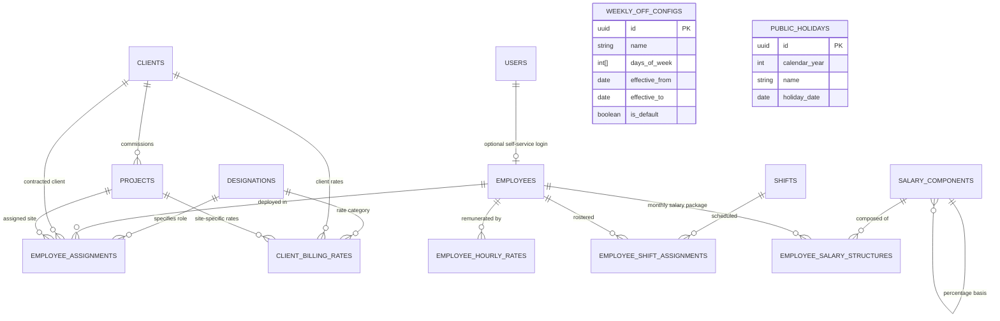

# Blue Royal HRMS — Phase 1 Architecture & Implementation Plan (Revised v3)

**Document ID:** `DOC-PLAN-PHASE1-003`  
**Date:** 2026-09-08  
**Status:** Architectural Plan — Final Revised Model  
**Scope:** Phase 1 Foundation Masters, Dual-Stream Rate Engine, Work Rostering & Effective-Dating Infrastructure  
**Prerequisites:** Phase 0 (Foundation, Auth, RBAC, Database & Audit Engine) — **Approved & Verified**

---

## 1. Architectural Decisions & Requirements Alignment

Following final architectural review, the Phase 1 specification resolves five critical design requirements:

1. **Official Four-Rate Resolution Flow for Invoicing / Billing:**
   - Established the strict point-in-time billing rate resolution pipeline:
     $$\text{Work Date} \longrightarrow \text{Employee Assignment} \longrightarrow \text{Client + Project + Designation} \longrightarrow \begin{cases} \text{Project-specific Billing Rate on Date} \\ \downarrow (\text{fallback}) \\ \text{Client-wide Billing Rate on Date} \\ \downarrow (\text{fallback}) \\ \textbf{MISSING\_BILLING\_RATE} \end{cases}$$
   - Established as a reusable backend domain service in Phase 1 for future consumption by Billing and Business Reports.
   - Strictly enforces zero derivation between employee payroll rates and client billing rates.

2. **Accurate Table Count (13 Tables in Phase 1):**
   - Corrected and reconciled the exact count of Phase 1 tables:
     1. `designations`
     2. `employees`
     3. `clients`
     4. `projects`
     5. `employee_assignments`
     6. `employee_hourly_rates`
     7. `client_billing_rates`
     8. `shifts`
     9. `employee_shift_assignments`
     10. `weekly_off_configs`
     11. `public_holidays`
     12. `salary_components`
     13. `employee_salary_structures`

3. **Designation Source of Truth (Assignment-Centric Historical Authority):**
   - Removed direct `designation_id` from the `employees` table to eliminate conflicting dual sources of truth.
   - `employee_assignments.designation_id` is the single, authoritative source of an employee's designation throughout their deployment history.
   - An employee's current designation is derived dynamically from their currently active assignment. If an employee has no active assignment, their designation state is unassigned.

4. **Strict Separation: Hourly Remuneration vs. Salary Structure:**
   - `employee_hourly_rates`: Governs hourly/timesheet-based remuneration (`normal_hourly_rate` + `ot_hourly_rate`).
   - `employee_salary_structures`: Governs monthly configured salary components (`Basic`, `HRA`, `TA`, `DA`, `Medical`, `Other`) linked to `salary_components`.
   - The two compensation schemas are kept strictly separate.

5. **Universal Reusable Point-in-Time Resolution Engine:**
   - Standardized temporal lookup pattern across all effective-dated entities:
     - Exact start date matching (`targetDate = effective_from`)
     - Exact end date matching (`targetDate = effective_to`)
     - Date before interval (`targetDate < effective_from`)
     - Date after interval (`targetDate > effective_to`)
     - Non-overlapping interval validation
     - Future scheduled changes
     - Historical point-in-time reconstruction

---

## 2. Point-in-Time Resolution Engine (Dual-Stream Model)

### 2.1 The Two Independent Financial Streams
Blue Royal HRMS strictly isolates **Labor Cost (Payroll)** from **Commercial Revenue (Billing)**.

```
┌─────────────────────────────────────────────────────────────────────────────────────────────────┐
│                                       WORK DATE: [ YYYY-MM-DD ]                                 │
└───────────────────────────────────────────────┬─────────────────────────────────────────────────┘
                                                │
                                                ▼
┌─────────────────────────────────────────────────────────────────────────────────────────────────┐
│                             EMPLOYEE ASSIGNMENT RESOLUTION                                      │
│                                                                                                 │
│  Query: employee_assignments WHERE employee_id = :empId                                         │
│         AND effective_from <= :workDate AND (effective_to IS NULL OR effective_to >= :workDate) │
│                                                                                                 │
│  Yields: { client_id, project_id, designation_id }                                              │
│  Failure: UNASSIGNED_EMPLOYEE (Work logged without active deployment)                          │
└───────────────────────┬─────────────────────────────────────────────────┬───────────────────────┘
                        │                                                 │
                        ▼                                                 ▼
┌───────────────────────────────────────────────┐ ┌───────────────────────────────────────────────┐
│        STREAM A: EMPLOYEE PAYROLL (COST)      │ │        STREAM B: CLIENT BILLING (REVENUE)     │
├───────────────────────────────────────────────┤ ├───────────────────────────────────────────────┤
│  Query: employee_hourly_rates                 │ │  Step 1: Project-Specific Rate                │
│         WHERE employee_id = :empId            │ │  Query: client_billing_rates                  │
│         AND effective_from <= :workDate       │ │         WHERE client_id = :clientId           │
│         AND (effective_to IS NULL             │ │           AND project_id = :projectId         │
│              OR effective_to >= :workDate)    │ │           AND designation_id = :designationId │
│                                               │ │           AND effective_from <= :workDate     │
│  Success:                                     │ │           AND (effective_to IS NULL           │
│    { normal_hourly_rate, ot_hourly_rate }     │ │                OR effective_to >= :workDate)  │
│                                               │ │                                               │
│  Failure:                                     │ │  Found? ──► YES: Return Project Billing Rate  │
│    MISSING_EMPLOYEE_PAY_RATE                  │ │          │                                    │
│    (Payroll calculation halts for this date)  │ │          └──► NO: Step 2 (Fallback)           │
│                                               │ │                                               │
│  * NEVER influenced by client billing rates.  │ │  Step 2: Client-Wide Rate (Fallback)          │
│  * Represents worker's contractual pay.       │ │  Query: client_billing_rates                  │
│                                               │ │         WHERE client_id = :clientId           │
│                                               │ │           AND project_id IS NULL              │
│                                               │ │           AND designation_id = :designationId │
│                                               │ │           AND effective_from <= :workDate     │
│                                               │ │           AND (effective_to IS NULL           │
│                                               │ │                OR effective_to >= :workDate)  │
│                                               │ │                                               │
│                                               │ │  Found? ──► YES: Return Client Billing Rate   │
│                                               │ │          │                                    │
│                                               │ │          └──► NO: MISSING_BILLING_RATE        │
│                                               │ │               (Flagged on Invoicing/Report)   │
└───────────────────────────────────────────────┘ └───────────────────────────────────────────────┘
```

### 2.2 Reusable Point-in-Time Resolution Service Contract
In Phase 1, we implement the backend service `BillingRateResolutionService` and `EffectiveDateService`:

```typescript
export interface ResolvedBillingRate {
  status: 'RESOLVED' | 'MISSING_ASSIGNMENT' | 'MISSING_BILLING_RATE';
  workDate: string;
  employeeId: string;
  clientId?: string;
  projectId?: string;
  designationId?: string;
  rateSource?: 'PROJECT_SPECIFIC' | 'CLIENT_WIDE_FALLBACK';
  normalBillingRate?: number;
  otBillingRate?: number;
  errorCode?: string;
  errorMessage?: string;
}
```

---

## 3. Detailed Entity Specifications (13 Tables)

### Table 1: `designations` (Master Catalog)
| Column | Type | Nullable | Description |
|---|---|---|---|
| `id` | UUID | No | Primary Key, default `gen_random_uuid()` |
| `code` | VARCHAR(32) | No | Unique code (e.g. `DES-ELEC`, `DES-MECH`, `DES-FOREMAN`) |
| `title` | VARCHAR(100) | No | Official designation title |
| `description` | VARCHAR(255) | Yes | Details / duties |
| `is_active` | BOOLEAN | No | Default `true` |
| `created_at` | TIMESTAMPTZ | No | Timestamp |
| `updated_at` | TIMESTAMPTZ | No | Timestamp |

---

### Table 2: `employees` (Core Biographical Identity Only)
*Designation has been removed from this table to prevent conflicting sources of truth. The employee's designation is derived from their active assignment in `employee_assignments`.*
*Compliance documents (Passport, Visa, Emirates ID, Licenses) are owned by the future Documents module.*

| Column | Type | Nullable | Description |
|---|---|---|---|
| `id` | UUID | No | Primary Key, default `gen_random_uuid()` |
| `employee_code` | VARCHAR(32) | No | Unique business code (e.g. `BR-00101`) |
| `user_id` | UUID | Yes | FK ➔ `users(id)` ON DELETE SET NULL (self-service portal login) |
| `first_name` | VARCHAR(100) | No | Given name |
| `middle_name` | VARCHAR(100) | Yes | Middle name |
| `last_name` | VARCHAR(100) | No | Family name |
| `gender` | VARCHAR(16) | No | Enum: `male`, `female`, `other` |
| `date_of_birth` | DATE | No | Birth date |
| `nationality` | VARCHAR(64) | No | Country of citizenship |
| `email` | VARCHAR(255) | Yes | Primary email |
| `phone_number` | VARCHAR(32) | Yes | Primary contact phone |
| `date_of_joining` | DATE | No | Joining date |
| `probation_end_date`| DATE | Yes | Probation completion target |
| `status` | VARCHAR(32) | No | Enum: `active`, `on_leave`, `probation`, `terminated`, `resigned`. Default `probation` |
| `created_at` | TIMESTAMPTZ | No | Timestamp |
| `updated_at` | TIMESTAMPTZ | No | Timestamp |
| `deleted_at` | TIMESTAMPTZ | Yes | Soft delete |

---

### Table 3: `clients` (Commercial Client Master)
| Column | Type | Nullable | Description |
|---|---|---|---|
| `id` | UUID | No | Primary Key |
| `code` | VARCHAR(32) | No | Unique client code (e.g. `CLI-ALNABOODAH`) |
| `name` | VARCHAR(255) | No | Legal entity name |
| `contact_person` | VARCHAR(100) | Yes | Contact person name |
| `contact_email` | VARCHAR(255) | Yes | Commercial email |
| `contact_phone` | VARCHAR(32) | Yes | Telephone number |
| `billing_address` | TEXT | Yes | Official billing address |
| `is_active` | BOOLEAN | No | Default `true` |
| `created_at` | TIMESTAMPTZ | No | Timestamp |
| `updated_at` | TIMESTAMPTZ | No | Timestamp |
| `deleted_at` | TIMESTAMPTZ | Yes | Soft delete |

---

### Table 4: `projects` (Client Work Site / Project Master)
| Column | Type | Nullable | Description |
|---|---|---|---|
| `id` | UUID | No | Primary Key |
| `client_id` | UUID | No | FK ➔ `clients(id)` ON DELETE RESTRICT |
| `code` | VARCHAR(32) | No | Unique project code (e.g. `PRJ-DOWNTOWN-T1`) |
| `name` | VARCHAR(255) | No | Site / project name |
| `site_location` | VARCHAR(255) | Yes | Physical location/emirate |
| `start_date` | DATE | Yes | Project start |
| `end_date` | DATE | Yes | Project completion |
| `status` | VARCHAR(32) | No | Enum: `planning`, `active`, `suspended`, `completed`. Default `active` |
| `created_at` | TIMESTAMPTZ | No | Timestamp |
| `updated_at` | TIMESTAMPTZ | No | Timestamp |
| `deleted_at` | TIMESTAMPTZ | Yes | Soft delete |

---

### Table 5: `employee_assignments` (Authoritative Historical Deployment & Designation)
*The authoritative historical source of both employee deployment and employee designation.*

| Column | Type | Nullable | Description |
|---|---|---|---|
| `id` | UUID | No | Primary Key |
| `employee_id` | UUID | No | FK ➔ `employees(id)` ON DELETE CASCADE |
| `client_id` | UUID | No | FK ➔ `clients(id)` ON DELETE RESTRICT |
| `project_id` | UUID | No | FK ➔ `projects(id)` ON DELETE RESTRICT |
| `designation_id`| UUID | No | FK ➔ `designations(id)` ON DELETE RESTRICT |
| `effective_from` | DATE | No | Start date of deployment |
| `effective_to` | DATE | Yes | End date (`NULL` = ongoing active deployment) |
| `remarks` | VARCHAR(255) | Yes | Operational deployment notes |
| `created_at` | TIMESTAMPTZ | No | Timestamp |
| `updated_at` | TIMESTAMPTZ | No | Timestamp |

**Indexes:**
- `CREATE INDEX idx_emp_assignments_timeline ON employee_assignments (employee_id, effective_from, effective_to);`
- `CREATE INDEX idx_emp_assignments_proj ON employee_assignments (project_id, designation_id);`

---

### Table 6: `employee_hourly_rates` (Payroll Cost Remuneration)
*Governs employee remuneration for hourly-paid labor. Never derived from client billing.*

| Column | Type | Nullable | Description |
|---|---|---|---|
| `id` | UUID | No | Primary Key |
| `employee_id` | UUID | No | FK ➔ `employees(id)` ON DELETE CASCADE |
| `normal_hourly_rate`| NUMERIC(10,2) | No | Remuneration per regular hour |
| `ot_hourly_rate` | NUMERIC(10,2) | No | Remuneration per overtime hour |
| `effective_from` | DATE | No | Start date of rate validity |
| `effective_to` | DATE | Yes | End date (`NULL` = ongoing active rate) |
| `change_reason` | VARCHAR(255) | Yes | e.g. `Annual Increment`, `Grade Revision` |
| `created_at` | TIMESTAMPTZ | No | Timestamp |
| `updated_at` | TIMESTAMPTZ | No | Timestamp |

**Indexes:**
- `CREATE INDEX idx_emp_hourly_rates_timeline ON employee_hourly_rates (employee_id, effective_from, effective_to);`

---

### Table 7: `client_billing_rates` (Commercial Invoicing Revenue)
*Governs rates billed to Clients for work executed. Project-specific rates take precedence over client-wide rates.*

| Column | Type | Nullable | Description |
|---|---|---|---|
| `id` | UUID | No | Primary Key |
| `client_id` | UUID | No | FK ➔ `clients(id)` ON DELETE CASCADE |
| `project_id` | UUID | Yes | FK ➔ `projects(id)` ON DELETE CASCADE (`NULL` = Client-wide default rate card) |
| `designation_id`| UUID | No | FK ➔ `designations(id)` ON DELETE RESTRICT |
| `normal_billing_rate`| NUMERIC(10,2) | No | Billed rate per normal hour |
| `ot_billing_rate` | NUMERIC(10,2) | No | Billed rate per overtime hour |
| `effective_from` | DATE | No | Start date of billing rate validity |
| `effective_to` | DATE | Yes | End date (`NULL` = ongoing active rate) |
| `created_at` | TIMESTAMPTZ | No | Timestamp |
| `updated_at` | TIMESTAMPTZ | No | Timestamp |

**Indexes:**
- `CREATE INDEX idx_client_billing_rates_lookup ON client_billing_rates (client_id, project_id, designation_id, effective_from, effective_to);`

---

### Table 8: `shifts` (Work Shift Master)
*No grace periods or unconfirmed penalty rules.*

| Column | Type | Nullable | Description |
|---|---|---|---|
| `id` | UUID | No | Primary Key |
| `code` | VARCHAR(32) | No | Unique code (e.g. `SH-DAY-8H`, `SH-NIGHT-10H`) |
| `name` | VARCHAR(100) | No | Display name |
| `start_time` | TIME | No | Shift start (e.g. `07:00:00`) |
| `end_time` | TIME | No | Shift end (e.g. `16:00:00`) |
| `break_minutes` | INTEGER | No | Scheduled break minutes (default 60) |
| `work_hours` | NUMERIC(4,2) | No | Net scheduled working hours (e.g. 8.00) |
| `is_night_shift` | BOOLEAN | No | Crosses midnight indicator |
| `is_active` | BOOLEAN | No | Default `true` |
| `created_at` | TIMESTAMPTZ | No | Timestamp |
| `updated_at` | TIMESTAMPTZ | No | Timestamp |

---

### Table 9: `employee_shift_assignments` (Roster Timeline)
| Column | Type | Nullable | Description |
|---|---|---|---|
| `id` | UUID | No | Primary Key |
| `employee_id` | UUID | No | FK ➔ `employees(id)` ON DELETE CASCADE |
| `shift_id` | UUID | No | FK ➔ `shifts(id)` ON DELETE RESTRICT |
| `effective_from` | DATE | No | Roster start date |
| `effective_to` | DATE | Yes | Roster end date (`NULL` = ongoing) |
| `created_at` | TIMESTAMPTZ | No | Timestamp |
| `updated_at` | TIMESTAMPTZ | No | Timestamp |

**Indexes:**
- `CREATE INDEX idx_emp_shift_timeline ON employee_shift_assignments (employee_id, effective_from, effective_to);`

---

### Table 10: `weekly_off_configs` (Calendar Weekend Settings)
| Column | Type | Nullable | Description |
|---|---|---|---|
| `id` | UUID | No | Primary Key |
| `name` | VARCHAR(100) | No | e.g. `Standard Weekend (Sunday)` |
| `days_of_week` | INTEGER[] | No | Array of off days (0 = Sunday, 6 = Saturday) |
| `effective_from` | DATE | No | Start date |
| `effective_to` | DATE | Yes | End date |
| `is_default` | BOOLEAN | No | Default configuration flag |
| `created_at` | TIMESTAMPTZ | No | Timestamp |
| `updated_at` | TIMESTAMPTZ | No | Timestamp |

---

### Table 11: `public_holidays` (Statutory Holidays)
| Column | Type | Nullable | Description |
|---|---|---|---|
| `id` | UUID | No | Primary Key |
| `calendar_year` | INTEGER | No | Calendar year (e.g. `2026`) |
| `name` | VARCHAR(150) | No | Name of public holiday |
| `holiday_date` | DATE | No | Unique holiday date |
| `description` | VARCHAR(255) | Yes | Notes |
| `created_at` | TIMESTAMPTZ | No | Timestamp |
| `updated_at` | TIMESTAMPTZ | No | Timestamp |

---

### Table 12: `salary_components` (Wage Component Master)
*Configuration-driven earnings and deductions for salaried employees.*

| Column | Type | Nullable | Description |
|---|---|---|---|
| `id` | UUID | No | Primary Key |
| `code` | VARCHAR(32) | No | Unique code (e.g. `BASIC`, `HRA`, `TA`, `DA`, `MEDICAL`) |
| `name` | VARCHAR(100) | No | Component name |
| `type` | VARCHAR(16) | No | Enum: `earning`, `deduction` |
| `calculation_type`| VARCHAR(16) | No | Enum: `fixed_amount`, `percentage` |
| `percentage_basis_component_id`| UUID | Yes | FK ➔ `salary_components(id)` (e.g. HRA calculated as % of Basic) |
| `is_recurring` | BOOLEAN | No | Monthly recurring vs. one-off |
| `is_wps_basic` | BOOLEAN | No | UAE WPS Basic salary flag |
| `is_wps_housing` | BOOLEAN | No | UAE WPS Housing allowance flag |
| `is_active` | BOOLEAN | No | Default `true` |
| `created_at` | TIMESTAMPTZ | No | Timestamp |
| `updated_at` | TIMESTAMPTZ | No | Timestamp |

---

### Table 13: `employee_salary_structures` (Salaried Employee Component Package)
*Distinct from `employee_hourly_rates`. Governs fixed/percentage compensation for monthly salaried employees.*

| Column | Type | Nullable | Description |
|---|---|---|---|
| `id` | UUID | No | Primary Key |
| `employee_id` | UUID | No | FK ➔ `employees(id)` ON DELETE CASCADE |
| `component_id` | UUID | No | FK ➔ `salary_components(id)` ON DELETE RESTRICT |
| `amount_or_percentage`| NUMERIC(10,2)| No | Monthly fixed currency amount or percentage value |
| `effective_from` | DATE | No | Start date of package |
| `effective_to` | DATE | Yes | End date (`NULL` = ongoing package) |
| `created_at` | TIMESTAMPTZ | No | Timestamp |
| `updated_at` | TIMESTAMPTZ | No | Timestamp |

**Indexes:**
- `CREATE INDEX idx_emp_salary_struct_timeline ON employee_salary_structures (employee_id, component_id, effective_from, effective_to);`

---

## 4. Entity Relationship Diagram (ERD)



---

## 5. Universal Effective-Dating Lookup Patterns & Test Suite

All effective-dated tables (`employee_assignments`, `employee_hourly_rates`, `client_billing_rates`, `employee_shift_assignments`, `weekly_off_configs`, `employee_salary_structures`) use a unified temporal management service.

### 5.1 SQL Query Specification
```sql
SELECT *
FROM {table_name}
WHERE {entity_foreign_key} = :entityId
  AND effective_from <= :targetDate
  AND (effective_to IS NULL OR effective_to >= :targetDate)
ORDER BY effective_from DESC
LIMIT 1;
```

### 5.2 Mandatory Test Matrix for Effective-Dating Lookups
Every effective-dated module is tested against the following 7 boundary test cases:
1. **Exact Start Date (`targetDate = effective_from`):** Record must resolve successfully.
2. **Exact End Date (`targetDate = effective_to`):** Record must resolve successfully on the final active day.
3. **Date Prior to Start (`targetDate < effective_from`):** Resolution returns null / error; cannot match a future record.
4. **Date After Closed End (`targetDate > effective_to`):** Resolution returns null / error; cannot match an expired record.
5. **Overlapping Interval Insertion Rejection:** Attempting to insert a record spanning an already-occupied interval throws a `ValidationError` (`OVERLAPPING_EFFECTIVE_INTERVAL`).
6. **Future Scheduled Slices:** Scheduling an upcoming rate change (e.g. effective next month) must not affect resolution on today's date.
7. **Historical Lookups:** Retroactive payroll/billing calculations must correctly resolve the historical slice that was active on the specified past work date.

---

## 6. Implementation Sequence for Phase 1

1. **Contracts Package (`@blue-royal/contracts`):**
   - Define TypeScript interfaces, request/response DTOs, and Zod schemas for all 13 tables.
   - Define point-in-time rate resolution contracts.
   - Compile contracts to `dist/`.
2. **Database Workspace (`database/`):**
   - Author migration `20260909000001-create-phase1-masters.ts` creating all 13 tables, foreign keys, constraints, and temporal indexes.
   - Author seeders for default `designations`, initial `salary_components` (`BASIC`, `HRA`, `TRANSPORT`), default `weekly_off_configs`, and UAE public holidays.
   - Seed granular permissions (`designations:*`, `employees:*`, `clients:*`, `projects:*`, `assignments:*`, `rates:*`, `shifts:*`, `salary_components:*`).
   - Run `npm run db:migrate` and `npm run db:seed`.
3. **Backend Service Layer (`backend/src/modules/`):**
   - Implement Sequelize models for all 13 tables.
   - Implement `EffectiveDateService` for interval validation, auto-closing prior records, and point-in-time lookups.
   - Implement `BillingRateResolutionService` implementing the Project ➔ Client-wide fallback flow.
   - Implement domain modules with controllers, routes, RBAC guards, and transaction handlers.
4. **Automated Testing Suite (`backend/tests/`):**
   - Comprehensive test suite covering the 7 boundary test cases for effective-dated lookups.
   - Four-rate resolution test verifying project-specific, fallback, and missing billing rate flows.
   - CRUD and RBAC integration tests for all 13 modules.
5. **Angular Standalone Frontend (`frontend/src/app/`):**
   - UI views for Designations, Clients, Projects, Shifts, Calendar, Salary Components, and Employee Management with Assignment, Pay Rate, and Salary Structure timelines.
6. **Full Verification:**
   - Execute `npm run build`, `npm run test`, `npm run lint`.
