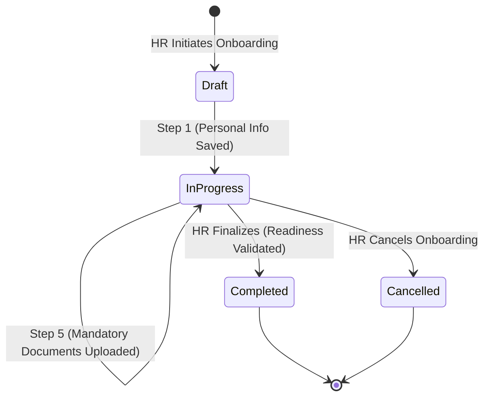
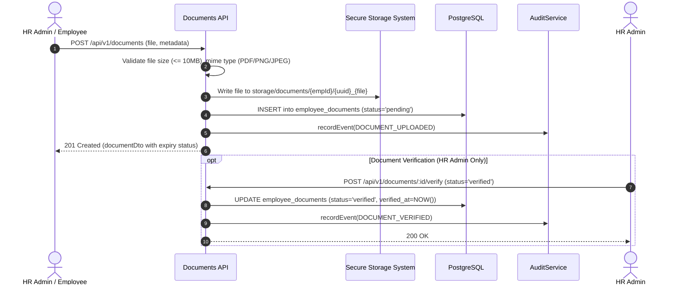

# Phase 5 Workflows Specification: Employee Onboarding, Documents & Expiry Management

**Document ID:** `WORKFLOW-PHASE5-001`  
**Phase:** Phase 5  
**Domain:** Workforce Onboarding, Employee Document Management & Regulatory Expiry Compliance  
**Author:** Blue Royal HRMS Architectural Engineering  
**Status:** Approved for Implementation  

---

## 1. Executive Summary

This document specifies the exact business domain workflows, state machines, validation rules, and authorization boundaries for Phase 5.

---

## 2. Employee Onboarding Lifecycle & State Machine

### 2.1 Onboarding Steps & Readiness Scoring
Onboarding progress is evaluated as a composite checklist across 5 mandatory operational milestones:

1. **`personal_info` (Weight: 20%):**
   - Employee code (unique, alphanumeric)
   - First name, last name
   - Gender, date of birth (valid past date)
   - Nationality
2. **`employment_details` (Weight: 20%):**
   - Employment type (`full_time` or `contract`)
   - Date of joining
   - Remuneration basis (`hourly` or `salaried`)
   - If contract: `contractEndDate` is required
3. **`assignment_setup` (Weight: 20%):**
   - Client assignment
   - Project assignment
   - Designation assignment
   - Effective from date
4. **`compensation_setup` (Weight: 20%):**
   - If `remuneration_basis == 'hourly'`: active `employee_hourly_rates` row exists
   - If `remuneration_basis == 'salaried'`: active `employee_salary_structures` rows exist
5. **`mandatory_documents` (Weight: 20%):**
   - Every `document_types` where `is_mandatory_for_onboarding == true` has at least one active, uploaded `employee_documents` record.

$$\text{Readiness Percentage} = \sum_{\text{milestone} \in \text{Checklist}} \text{milestone.completed} \times 20\%$$

### 2.2 Finalization Validation Gate
When HR Admin calls `POST /api/v1/onboarding/:id/complete`:
- System validates that $\text{Readiness Percentage} == 100\%$.
- System ensures employee is not already active.
- System transitions `employee.status` from `'onboarding'` to `'probation'` (or `'active'`).
- System stamps `completed_at = NOW()` and `completed_by_user_id = req.user.id`.
- Emits `ONBOARDING_COMPLETED` audit event with full snapshot.

---

## 3. Employee Document Management Workflow

### 3.1 Document Versioning & Replacement
When a renewed document is submitted for an existing document type:
- The previous document row is retained (for compliance audit history).
- Its `is_active` flag is set to `false`.
- The new document record is inserted with `is_active = true`.

---

## 4. Expiry Classification & Alert Rules

1. Every document with `has_expiry == true` and an `expiry_date` is dynamically classified on read:
   - `diff < 0`: **EXPIRED** — Immediate compliance violation.
   - `0 <= diff <= 30`: **CRITICAL_EXPIRY** — Urgent renewal needed within 30 days.
   - `31 <= diff <= 60`: **APPROACHING_EXPIRY** — Renewal notice window.
   - `diff > 60`: **VALID** — Compliant.
2. The operational dashboard surfaces:
   - Total documents expiring within 30 days.
   - Total expired documents currently active.
   - Incomplete new hire onboarding count.
3. Employee Self-Service:
   - Employees see their own statutory documents.
   - Warning banners indicate impending expiry of their passport, visa, or Emirates ID.
