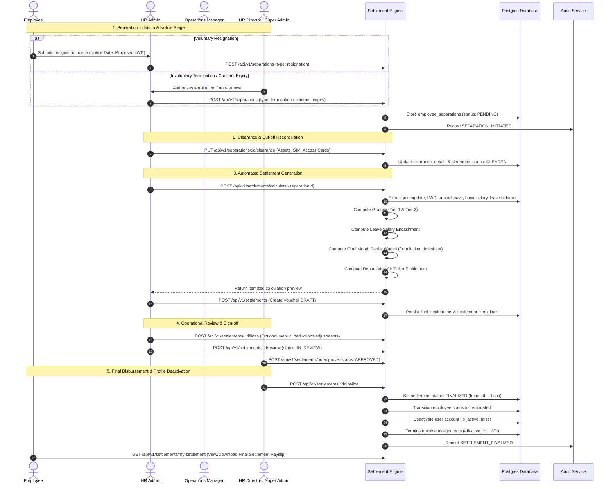
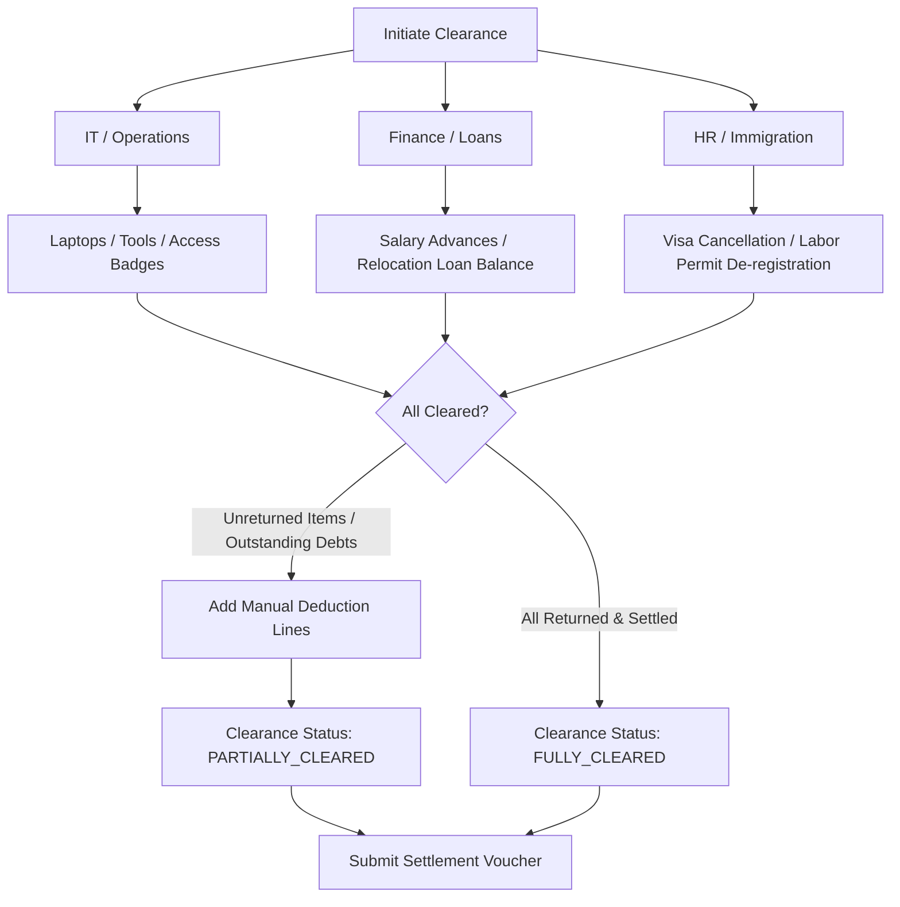

# Phase 6 Workflows: Employee Separation, Final Settlement & Gratuity

**System:** Blue Royal HRMS  
**Module:** Phase 6 — End-of-Service Settlement Operational Workflows  
**Status:** Architecture & Requirements Definition (Pre-Implementation Pass)  
**Baseline Standards:** `Master.md`, `docs/PROJECT_STATUS.md`, `docs/architecture/PHASE6_FINAL_SETTLEMENT_ARCHITECTURE.md`

---

## 1. End-to-End Separation & Settlement Lifecycle (WF-8)



---

## 2. Statutory Gratuity Calculation Engine Workflow

```
                        [ Start Gratuity Calculation ]
                                      │
                                      ▼
             [ Fetch employee.date_of_joining & last_working_day ]
                                      │
                                      ▼
           [ Deduct Unpaid Leave & Unauthorized Absence Calendar Days ]
                                      │
                                      ▼
                 [ Compute Net Service Days = Gross Days - Unpaid Days ]
                 [ Net Service Years = Net Service Days / 365.0 ]
                                      │
                                      ▼
                           Is Service Years >= 1.0?
                                   /      \
                           NO     /        \   YES
                                 ▼          ▼
                       [ Gratuity = 0.00 ]  [ Extract Last Basic Salary (is_wps_basic = true) ]
                                            [ Daily Basic Wage = Last Basic Salary / 30.0 ]
                                                    │
                                                    ▼
                                            Is Service Years <= 5.0?
                                                    /      \
                                            YES    /        \   NO
                                                  ▼          ▼
                        [ Tier 1 Gratuity: ]             [ Tier 1 Gratuity: ]
                        Service Years * 21 * DailyWage   5.0 * 21 * DailyWage
                                                                 +
                                                         [ Tier 2 Gratuity: ]
                                                         (Service Years - 5.0) * 30 * DailyWage
                                                    │        │
                                                    ▼        ▼
                                          [ Gross Gratuity Amount ]
                                                    │
                                                    ▼
                                   Does Gross Gratuity > (24 * Monthly Basic)?
                                                    /      \
                                            YES    /        \   NO
                                                  ▼          ▼
                                        [ Cap at 24 * Basic ] [ Final Gratuity = Gross ]
                                                    │        │
                                                    └────┬───┘
                                                         ▼
                                          [ Record Itemized Gratuity Lines ]
```

---

## 3. Leave Salary Encashment Workflow

1. **Annual Leave Balance Inquiry:**
   - Query `employee_leave_balances` for `leave_type.code == 'ANNUAL'` for the current calendar year.
   - Extract `allocatedDays`, `carriedForward`, `usedDays`, and `pendingDays`.
2. **Pro-Rata Current Year Accrual Adjustment:**
   - Standard statutory entitlement: 30 calendar days per year ($2.5$ days per completed service month).
   - Calculate completed service months in the exit calendar year up to `last_working_day`:
     $$\text{Accrued Days in Year} = \text{Completed Months} \times 2.5$$
   - Net unspent leave:
     $$\text{Remaining Leave Days} = \text{Carried Forward} + \text{Accrued Days in Year} - \text{Used Days}$$
3. **Valuation:**
   - $\text{Daily Basic Wage} = \text{Monthly Basic Salary} / 30.0$
   - $\text{Leave Salary Encashment} = \text{Remaining Leave Days} \times \text{Daily Basic Wage}$
4. **Negative Balance Handling:**
   - If $\text{Remaining Leave Days} < 0$ (employee took more leave than accrued):
     - Amount is converted into a **Deduction Line Item** (`category: 'recovery'`, `code: 'LEAVE_OVERDRAWN_RECOVERY'`).
     - $\text{Recovery Amount} = |\text{Remaining Leave Days}| \times \text{Daily Basic Wage}$.

---

## 4. Repatriation Air Ticket Entitlement Workflow

1. **Eligibility Evaluation:**
   - Check `employee.nationality` (UAE Nationals excluded from repatriation tickets).
   - Check `employee_separations.has_new_uae_employment`:
     - If `true` (employee transferred work permit to a new employer in UAE): **Exempt from repatriation ticket**.
   - Check separation type and contractual notice compliance:
     - If employee resigned with notice shortfall without justification: Flag for review.
2. **Cost Derivation:**
   - If company policy uses a standard destination allowance matrix:
     - Gulf / Middle East: AED 1,000
     - South Asia (India, Pakistan, Bangladesh, Sri Lanka, Nepal): AED 1,500
     - Southeast Asia (Philippines, Indonesia): AED 2,000
     - Africa / Europe / Other: AED 2,500
   - *Note: Exact tariff matrix flagged under `BUSINESS RULE REQUIRES APPROVAL`.*
3. **Disbursement Form:**
   - **Cash Encashment:** Added as earning line `AIR_TICKET_ALLOWANCE` to final settlement voucher.
   - **Physical Ticket Booking:** HR uploads confirmed itinerary to Phase 5 documents; voucher amount is AED 0.00 with note "Flight ticket booked directly by employer".

---

## 5. Final Month Attendance & Wage Reconciliation Workflow

1. **Identify Unpaid Working Interval:**
   - Start Date: 1st calendar day of the month containing `last_working_day`.
   - End Date: `last_working_day`.
2. **Check Prior Monthly Payroll Status:**
   - Query `payroll_periods` for `period_code == YYYY-MM`.
   - **Scenario A: Regular monthly payroll already finalized:**
     - The employee's regular wages were already disbursed in that payroll cycle.
     - Final settlement wage line = `0.00 AED` (Prevents duplicate wage payment).
   - **Scenario B: Regular monthly payroll NOT finalized / open:**
     - System extracts locked attendance records between 1st of month and `last_working_day`.
     - **For Hourly Employees:**
       $$\text{Final Wages} = (\sum \text{Regular Hours} \times \text{Hourly Rate}) + (\sum \text{OT Hours} \times \text{OT Rate})$$
     - **For Salaried Employees:**
       $$\text{Pro-Rata Fraction} = \frac{\text{Worked Calendar Days up to LWD}}{\text{Total Calendar Days in Month}}$$
       $$\text{Final Wages} = \text{Monthly Gross Package} \times \text{Pro-Rata Fraction} - (\text{Unpaid Absences} \times \text{Daily Gross Wage})$$
     - Add `FINAL_MONTH_WAGES` to settlement voucher.
     - Flag employee as `settlement_processed = true` so subsequent monthly payroll run ignores this employee.

---

## 6. Financial Clearance & Recovery Workflow

Before settlement approval, departmental clearance must be documented:



### Statutory Deduction Restrictions (UAE Labor Law Protection)
- Visa, work permit, labor card, and medical test costs incurred during recruitment **cannot be deducted from final settlement by law**.
- Non-statutory deductions (loans, damages) cannot exceed 50% of the aggregate settlement amount without formal Ministry/court approval.

---

## 7. Settlement Voucher Locking, Audit & Unlock Workflow

1. **Finalize Action (`settlements:finalize`):**
   - Validates that clearance status is `fully_cleared` or explicit deduction acknowledgment is provided.
   - Sets `final_settlements.status = 'finalized'`.
   - Sets `finalized_at = NOW()`, `finalized_by = actorId`.
   - Freezes all itemized lines (`settlement_item_lines`).
   - Updates `employees.status = 'terminated'` and soft-deletes related user credentials (`users.is_active = false`).
   - Closes active project assignments (`effective_to = last_working_day`).
   - Records `SETTLEMENT_FINALIZED` audit event.
2. **Super Admin Unlock Override (`settlements:unlock`):**
   - Strictly reserved for `super_admin` role (HR Admin receives HTTP 403).
   - Requires mandatory justification note ($\ge 15$ characters).
   - Transitions settlement to `unlocked` / `draft`.
   - Re-enables editing of lines and recalculation.
   - Re-activates employee profile temporarily if needed for payroll adjustment.
   - Records `SETTLEMENT_UNLOCKED` audit event with reason, actor ID, IP, and timestamp.

---

## 8. Employee Self-Service (ESS) Final Statement Workflow

1. Employee logs in prior to final account deactivation (or receives cryptographically signed settlement statement / payslip via email).
2. Accesses route `/settlements/my-settlement`.
3. System verifies `req.user.employeeId` matches settlement record.
4. Renders breakdown:
   - Service duration (Joining date to Last Working Day).
   - Last Basic Salary & Daily Wage basis.
   - Gratuity calculation breakdown (Tier 1 + Tier 2).
   - Leave salary encashment breakdown (remaining days $\times$ daily rate).
   - Repatriation flight allowance.
   - Final month wages and itemized deductions/recoveries.
   - Net settlement payable.
5. Provides one-click **"Download Settlement Voucher (PDF)"** for employee signature and statutory labor records.
